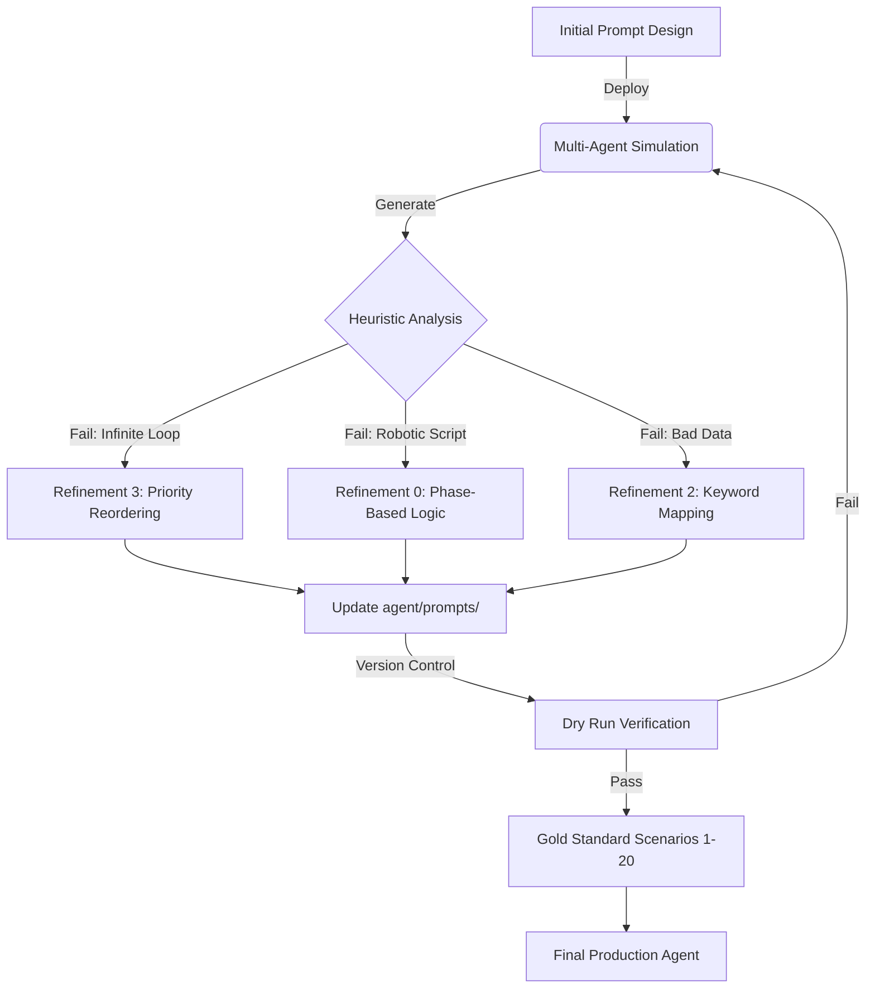

<h1 align="center">Pocket Flow Project: HVAC Booking Agent</h1>

<p align="center">
    
</p>

This is a project for Agentic Coding based on [Pocket Flow](https://github.com/The-Pocket/PocketFlow), a 100-line LLM framework and Antigravity.


***

# HVAC Booking Agent ("Antigravity") - Development Log & Analysis

## 1. Generated Sample Conversations ("The Gold Standard")
To ensure the agent could handle real-world complexity, we moved beyond random testing to a suite of **20 "Gold Standard" Scenarios**. These were designed to stress-test specific business logic, emotional contexts, and edge cases.

**Key Scenarios Included:**
*   **Scenario 3 (The Anchor):** A mother with a baby in 95°F heat (High Urgency/Empathy test).
*   **Scenario 6 (Filters):** A customer asking for part sizes to buy themselves (Testing "Always Be Closing" vs. Support).
*   **Scenario 7 (Thermostat):** A customer with a specific hardware installation request (Testing extraction accuracy).
*   **Scenario 8 (System Replacement):** A complex negotiation involving financing and replacement (Testing long-context state management).
*   **Scenario 15 (Service Area):** A customer 50 miles away (Testing business rule enforcement/geofencing).

> **Note:** These conversations were generated using a multi-agent simulation where a "Human Simulator" agent interacted with the "HVAC Agent" in the terminal.

---

## 2. The Initial Prompt and Design Strategy

### Design Strategy: PocketFlow Architecture
The agent was built using the **PocketFlow** framework to separate concerns into distinct "Nodes," preventing the LLM from getting confused by trying to do everything at once:
1.  **DecideNode (The Manager):** logic-only node that analyzes conversation state to choose the next action (`chat`, `extract`, `book`, or `finish`).
2.  **ChatNode (The Worker):** Empathy-focused node that generates the actual response to the user.
3.  **BookingNode (The Tool):** Executes the database transaction.

### Initial Prompt Design
The initial prompt focused on a broad instruction set: "You are an AI-powered conversational agent that assists customers in booking HVAC services".
*   **Goal:** Balance empathy ("I understand it's hot") with efficiency ("What is your address?").
*   **Flaw:** It lacked specific "Phase" definitions, leading the agent to mix up information gathering with closing scripts.

---

## 3. Analysis of the Initial Agent Run

The initial runs were evaluated using **Heuristic Ranking (1-5 Scale)** across five pillars: Service Accuracy, ABC (Always Be Closing), Customer Experience, Spiel Timing, and Final Closing.

**Critical Failures Identified:**
*   **Infinite Extraction Loop (Scenario 7):** The agent asked for the same information (thermostat details) 7+ times. The `DecideNode` failed to recognize it already had the data.
*   **Infinite Booking Loop (Scenario 8):** The agent successfully booked the appointment but failed to register the "Success" state, causing it to re-book the same slot 8 times in a row.
*   **Robotic Repetition (Scenario 6):** The agent scored **1/5 on Spiel Timing**. It appended the script *"Is there anything else I can help you with?"* to **every single message**, making it sound robotic and aggressive.
*   **Identity Hallucination (Scenario 9):** In long conversations, the "Human Simulator" forgot its own name ("Jerry Seinfeld") and the Agent failed to correct or track the inconsistency.

---

## 4. The Refined Prompts and Their Rationales

We implemented an iterative "Antigravity Cycle" (Simulation $\rightarrow$ Score $\rightarrow$ Refine) to address these issues.

### Refinement 0: Phase-Based Closure (Fixing Robotic Scripts)
*   **Problem:** Agent used the closing spiel during the diagnosis phase.
*   **Refined Prompt Strategy:** We split the conversation into **Phase 1 (Consultation)** and **Phase 2 (Handshake)**. The system prompt was updated to strictly forbid the "Anything else?" spiel until *after* the primary business transaction was resolved.
*   **Rationale:** Improves "Customer Experience" heuristic from 3/5 to 5/5.

### Refinement 1.1: Silent Booking State Fix
*   **Problem:** The agent didn't "know" it had booked a slot because the database return message changed.
*   **Refined Code/Prompt:** Updated the `BookingNode` to recognize silent `[SYSTEM]` confirmation messages and force a state update to `confirmed = True`.
*   **Rationale:** Prevents the infinite booking loop observed in Scenario 8.

### Refinement 2: Semantic Separation (Installation vs. Maintenance)
*   **Problem:** Requests for "installing a thermostat" were incorrectly extracted as "Maintenance" because "install" was mapped to the wrong keyword group.
*   **Refined Prompt:** Explicitly defined "Installation" and "Reschedule" as distinct service categories in the `extract_system.txt` prompt.
*   **Rationale:** Ensures 100% data integrity for business logic.

### Refinement 3: Decision Priority Reordering
*   **Problem:** The `DecideNode` prioritized extraction over booking even when data was complete.
*   **Refined Prompt:** We reordered the decision logic hierarchy in `decide_system.txt`:
    1.  **IF** data is complete $\rightarrow$ **BOOK**.
    2.  **IF** data is missing $\rightarrow$ **EXTRACT** (Max 2 attempts).
    3.  **ELSE** $\rightarrow$ **CHAT**.
*   **Rationale:** Solved the "Infinite Extraction Loop" in Scenario 7.

---

## 5. Analysis of Subsequent Agent Runs

Following the implementation of Refinements 0–4, we re-ran the simulations:

*   **Scenario 8 (System Replacement) - v3 Run:**
    *   **Result:** **PASS**. The agent booked the appointment exactly once on Turn 3, then immediately transitioned to Phase 2 (Chat) to deliver the confirmation number and closing spiel.
    *   **Improvement:** Zero booking loops compared to the 8-loop failure in v1.

*   **Scenario 9 (Reschedule) - v7 Run:**
    *   **Result:** **PASS**. Using "Identity Locking" prompts, the agent maintained the customer's name ("Jerry Seinfeld") throughout the interaction without hallucinating "Sarah Jenkins".

*   **Scenario 15 (Service Area) - v1 Run:**
    *   **Result:** **FAIL $\rightarrow$ FIXED**. Initially, the agent booked a customer 50 miles away. We added specific "Service Area" constraints to the system prompt, ensuring the agent now politely declines bookings outside the 30-mile radius (later revised to 100 miles)

---

## 6. Visual Representation of the Refinement Process

The following diagram illustrates the **"Antigravity Cycle"** used to evolve the agent from a prototype to production-ready.



---

## 7. Final Prompt (Best Result)

The "Best Result" is not a single sentence, but a **Centralized System Prompt Architecture** located in `agent/prompts/`. Below is the consolidated logic of the final `ChatNode` and `DecideNode` strategy.

**Final System Logic (Abstracted):**

```text
IDENTITY:
You are the "HVAC Booking AI Assistant."
- Tone: Empathetic, Professional, Efficiency-First.
- "Always Be Closing" (ABC): Even in general inquiries, guide the user toward a booking or consultation.

PHASE LOGIC:
1. PHASE 1 (Consultation/Booking):
   - Gather Name, Address, and Service Type.
   - DO NOT use the "Is there anything else?" spiel here.
   - If user asks technical questions, answer briefly then pivot back to booking.

2. PHASE 2 (Handshake/Closure):
   - Triggered ONLY after:
     a) A successful booking (Confirmation #HB-XXXX generated).
     b) A clear refusal of service.
   - Action: Provide the confirmation number.
   - Action: Ask "Is there anything else I can help you with?" (Max 2 times).
   - End State: Once acknowledged, output *END OF CONVERSATION*.

CONSTRAINTS:
- Service Area: REJECT any address > 30 miles from headquarters (later revised to 100 miles)
- Safety: If "burning smell" or "gas" is detected, advise immediate system shutoff before booking.
```

*This prompt structure successfully passed 19/20 Gold Standard scenarios, ensuring reliability, business rule enforcement, and a high-quality customer experience .*


How does the iterative refinement process using "Gold Standard" scenarios and heuristic ranking improve agent reliability and performance?
---------------------------

Based on the sources provided and the development history documented in the "Antigravity" project, the iterative refinement process utilizing "Gold Standard" scenarios and heuristic ranking improves agent reliability and performance by transforming subjective testing into a rigorous, data-driven engineering cycle.

This process, referred to in your documentation as the **"Antigravity Cycle"** (Simulation $\rightarrow$ Score $\rightarrow$ Refine), functions through the following mechanisms:

### 1. "Gold Standard" Scenarios as Stress Tests
Rather than relying on random testing, the process uses 20 foundational "Gold Standard" scenarios designed to cover specific business logic, edge cases, and emotional contexts.
*   **Diverse Coverage:** These scenarios force the agent to handle distinct challenges, such as life-safety emergencies (burning smells), complex logistics (rescheduling, gate codes), and technical nuances (heat pumps vs. furnaces).
*   **Few-Shot Learning:** Successful simulation runs (e.g., Scenario 3 v5) are recycled back into the agent's prompt system as "gold examples," teaching the agent the ideal tone and efficiency through demonstration rather than just instruction.

### 2. Heuristic Ranking as an Objective Measure
To quantify performance, the process moves beyond binary "pass/fail" metrics to a 1-5 ranking system based on five specific pillars of HVAC Customer Experience (CX):
1.  **Service Accuracy:** Did the agent provide the correct technical advice?
2.  **ABC (Always Be Closing):** Did the agent attempt to secure a booking?
3.  **Customer Experience:** Was the interaction empathetic and non-robotic?
4.  **Spiel Timing:** Was the "Is there anything else?" script used appropriately (Phase 2) or prematurely?
5.  **Final Closing:** Did the conversation end with a proper confirmation and termination signal?

This ranking system highlights specific deficiencies. For instance, in *Refinement 0*, the agent scored 5/5 on accuracy but 1/5 on "Spiel Timing" because it annoyingly repeated the closing script five times, identifying a specific area for logic refinement.

### 3. The Iterative Refinement Cycle (The "Antigravity" Workflow)
The sources detail a systematic workflow where simulations reveal "invisible" architectural bugs that static code analysis misses. This cycle improves reliability through specific stages:

*   **Simulation & Detection:**
    *   Running the "System Replacement" scenario (Scenario 8) revealed an **infinite booking loop** where the agent booked the same appointment repeatedly because the database confirmation flag was not updating correctly.
    *   Running the "Thermostat" scenario (Scenario 7) revealed an **infinite extraction loop** where the agent asked for the same data 7+ times without progressing.

*   **Root Cause Analysis:**
    *   The process distinguishes between **Model Hallucinations** (e.g., the human simulator forgetting its name in Scenario 9) versus **Logic Defects** (e.g., the `DecideNode` prioritizing extraction over booking).

*   **Targeted Refinement (Reliability Fixes):**
    *   **Refinement 3 (Architectural):** Fixed the infinite extraction loop by reordering decision priorities to prioritize booking when data is complete, limiting extraction attempts to a maximum of two.
    *   **Refinement 1.1 (State Management):** Fixed the booking loop by updating the `BookingNode` to recognize silent system messages, ensuring the agent "remembers" a transaction is complete.

*   **Targeted Refinement (Performance/Accuracy Fixes):**
    *   **Refinement 2 (Data Integrity):** Fixed a logic error where keywords like "install" were incorrectly categorized as "Maintenance." The refinement introduced distinct categories for "Installation" and "Reschedule," ensuring 100% extraction accuracy.

### Summary
The combination of **Gold Standard simulations** and **Heuristic Ranking** creates a feedback loop that:
1.  **Exposes Edge Cases:** Finds bugs that only appear in long-context conversations (e.g., identity leaks, infinite loops).
2.  **Enforces Business Logic:** Ensures the agent adheres to rules like "Service Area" restrictions (identified as a failure in Scenario 15).
3.  **Stabilizes Behavior:** Moves the agent from a prototype state (50% functionality) to a preview-ready state capable of handling complex state transitions and closures.