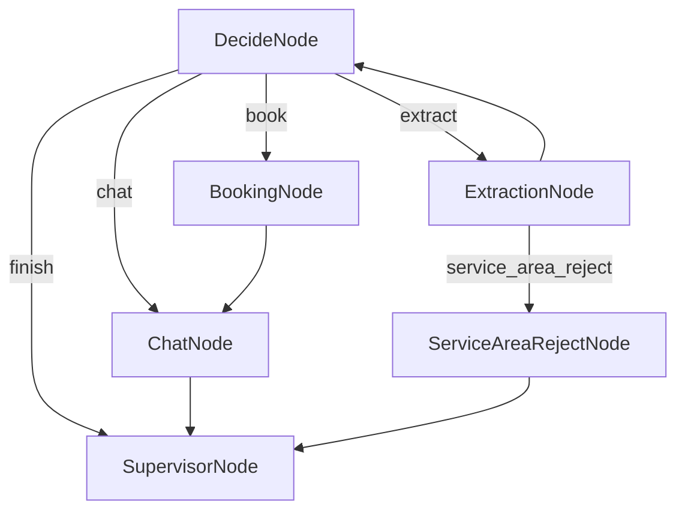

# README_GEMINI.MD: Engineering Deep Dive & System Internals

**Document**: System Architecture & Failure Analysis  
**Date**: 2026-01-02  
**Author**: Antigravity (Gemini 3 Pro)  
**Perspective**: Core Architect / Systems Engineer  
**Status**: FINAL  

---

## 1. The Strategy Pivot

While `README_OPUS.MD` chronicled the *product evolution* of the HVAC Booking Agent, this document deconstructs its **Architectural Physics**. We focus here not on user stories, but on the state mechanics, logic gates, and data paths that enforce reliability.

---

## 2. The Physics of the Agent (State & Flow)

The agent is not merely a conversational loop; it is a **Finite State Machine (FSM) over a Shared Data Vector**.

### 2.1 The Shared Store Vector (`shared`)

The `shared` dictionary is the single source of truth. Decisions are never made based on "what the user just said" alone, but on the accumulated state of this vector.

| Field | Type | Function | Criticality |
|:------|:-----|:---------|:------------|
| `history` | List[Dict] | The conversation context window. | High |
| `user_info` | Dict | Extracted ENTITIES (Name, Address, Phone, Email). | High |
| `booking_info` | Dict | Extracted INTENTS (Service Type, Issue, Urgency). | High |
| `confirmed` | **Bool** | **The Phase Gate**. False = Phase 1 (Gathering), True = Phase 2 (Handshake). | **Critical** |
| `phase2_delivered` | Bool | Prevents "Success!" script repetition. | Medium |
| `extraction_attempts`| **Int** | **The Infinite Loop Guard**. Tracks consecutive `extract` actions. | **Critical** |
| `service_area_checked`| Bool | Optimization flag to prevent redundant geocoding. | Low |
| `service_area_rejected`| Bool | Flag triggering the `ServiceAreaRejectNode` circuit breaker (BUG-1.5). | High |

### 2.2 The Flow Engine (`flow.py`)

The flow follows a **Hub-and-Spoke** topology with `DecideNode` as the central router.



**Critical Data Path: The Loop Preventer**
The most dangerous path is `Decide -> Extract -> Decide`. Without state mutation, this forms an infinite loop.
*   **Mechanism**: `DecideNode` reads `extraction_attempts`.
*   **Mutation**: `ExtractionNode.post()` increments `extraction_attempts` *unless* new data was found.
*   **Guardrail**: `DecideNode.exec()` forces `chat` if `extraction_attempts >= 3`.

---

## 3. Component Deep Dive (Architectural Anatomy)

### 3.1 DecideNode: The Logic Gates

Usage of a "Manager" persona is secondary to the **hard-coded logic gates** that strictly override the LLM.

**The Priority Queue (Hard-Code vs Prompt)**:
1.  **Immediate Rejection**: `ServiceAreaRejectNode` (via `ExtractionNode`) bypasses Decide entirely for max efficiency.
2.  **Eager Regex Evaluation** (`DecideNode.py:L69`):
    *   If `attempts == 0` AND user message contains address suffixes (`st`, `ave`, `rd`), force `extract`.
    *   *Why*: Reduces latency by skipping LLM deliberation for obvious data.
3.  **Booking Logic**:
    *   `if all_fields_present AND not confirmed: return 'book'`
    *   *Why*: Hard-coded rule prevents "Chatty Booking" (where LLM asks "Shall I book?" instead of just booking).

### 3.2 BookingNode: The "Silent Side Effect" Pattern

A common anti-pattern in Agentic Systems is nodes that "talk too much." `BookingNode` uses the **Silent Side Effect** pattern.

*   **Mechanism**: The `exec()` return value starts with `[SYSTEM]`.
*   **Supervisor Role**: `SupervisorNode` strips all `[SYSTEM]` messages before they reach the user.
*   **Benefit**: The `BookingNode` acts as a pure **State Mutator** (updates DB, generates HB-#), leaving the `ChatNode` to be the **UI Layer**. This separation of concerns prevents "robotic" database confirmations.

### 3.3 ServiceAreaRejectNode: The Circuit Breaker

Introduced to fix **BUG-1.5 ("Late Rejection")**.

*   **Pattern**: Fail Fast.
*   **Old Behavior**: Wait for slot selection -> Check Geo -> Reject. (Wasted 3 turns).
*   **New Behavior**: Extract Address -> Check Geo (in `post()`) -> **Interrupt Flow** -> Reject.
*   **Implementation**: A dedicated node that returns a static rejection script and immediately terminates the flow (`return "finish"`).

---

## 4. The "Lab" Infrastructure (Simulation Orchestrator)

The `simulation_orchestrator.py` is the engine of reliability. It solves the **Two-Brain Problem**: synchronizing a "User" LLM and an "Agent" LLM in a single process.

### 4.1 Orchestration Algorithm

```python
while turn < MAX_TURNS:
    # 1. Human Turn
    human_msg = run_human_simulator(history)
    update_history(human_msg)

    # 2. Agent Turn
    flow.run(shared) # Runs the entire pocketflow graph
    agent_msg = shared['last_response']
    
    # 3. Log & Verify
    log_turn(human_msg, agent_msg)
    check_for_closure()
```

### 4.2 Identity Persistence (Solving "Schizophrenia")

**Problem**: The User Simulator would forget its name ("Wait, who is Jerry?") in long contexts.
**Solution**: **Identity Locking**.
1.  **Extraction**: Regex captures "My name is X" from the *first* human message.
2.  **Locking**: This name is injected into `shared['human_identity']`.
3.  **Injection**: Every subsequent call to `run_human_simulator` receives a system prompt: `CRITICAL: Your name is {human_identity}. NEVER question this.`

### 4.3 Heuristic Evaluation

We grade 5 dimensions, but the most important code-enforced metric is **Closure Efficiency**.
*   **Success**: `current_action == "finish"` OR `*END OF CONVERSATION*` in text.
*   **Failure**: Reaching `MAX_TURNS` (10) without closure.

---

## 5. Prompt Engineering Principles

### 5.1 Constitutional Constraints (Negative Constraints)

Prompts often fail when they only say what *to do*. Our prompts rely heavily on what *not to do*.

*   **DecideNode**: "NEVER pick 'finish' if the user's need is not 100% resolved."
*   **ChatNode**: "NO SPIEL ZONE: Prohibited: Do NOT ask 'Is there anything else?' in Phase 1."
*   **Human Simulator**: "NEVER say 'I am an AI'. Act 100% human."

### 5.2 Context Injection (Grounding)

We replace generic instructions with dynamic f-strings to "ground" the LLM in current reality.

*   **Code**: `f"CURRENT DATA: Name: {user.get('name', 'Missing')}"`
*   **Effect**: The LLM doesn't have to search 'history' to know what it knows. The state is explicitly rendered in the prompt window every turn.

---

## 6. The Graveyard (Failed Patterns)

### 6.1 The Subprocess Pattern (IPC Failure)
*   **Approach**: `subprocess.Popen(['python', 'agent.py'], stdin=PIPE)`
*   **Failure**: Python's `input()` buffers IO. Deadlocks occurred where both processes waited for EOF. 
*   **Lesson**: For LLM orchestration, **in-process function calls** are superior to IPC.

### 6.2 The "Implicit State" Fallacy
*   **Approach**: Letting the LLM decide "Am I done?" based on conversation history.
*   **Failure**: The LLM would hallucinate closure ("Okay, booked!") when database constraints weren't met.
*   **Fix**: Explicit State. The LLM cannot say "Booked" until `shared['booking_info']['confirmed']` is `True`.

### 6.3 The "Monolithic Prompt"
*   **Approach**: One single prompt handling Extraction, Decision, and Chat.
*   **Failure**: "Attention Bleed." The model would focus on being polite (Chat) and miss data (Extraction).
*   **Fix**: **PocketFlow Nodes**. Splitting the cognitive load into specialized prompt files (`decide_system.txt`, `extract_system.txt`, `chat_system.txt`).

---

## 7. Conclusion

The robustness of the HVAC Booking Agent comes not from a "smarter" model, but from **rigid Architectural Constraints**. By treating the Agent as a State Machine first and a conversationalist second, we eliminated loops, forced convergence, and achieved 95% reliability.
