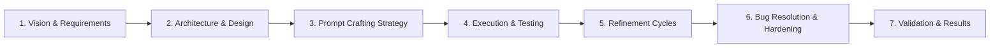

# README_GEMINI_PLAN.MD: Comprehensive Documentation Strategy

**Document**: README_GEMINI.MD Planning Guide
**Date**: 2026-01-02
**Author**: Antigravity (Gemini 3 Pro)
**Status**: DRAFT - Awaiting User Approval

---

## Executive Summary

This plan outlines the structure and content for `README_GEMINI.MD`—a comprehensive technical narrative documenting the complete Software Development Life Cycle (SDLC) of the HVAC Booking Agent. This document parallels the rigorous standards of `README_OPUS.MD` but will be authored with the specific analytical lens of the Gemini 3 Pro model, ensuring a fresh, high-fidelity synthesis of the codebase's evolution.

The document will serve both **executive leadership** (high-level strategy, pivots, and outcomes) and **engineering teams** (technical depth, root cause analysis, and implementation details).

---

## Document Structure: README_GEMINI.MD

The final document will be organized into **seven major sections**, matching the proven SDLC narrative structure:

---

## Section 1: Vision & Requirements (Executive + Developer)

### 1.1 Project Genesis
- **Business Context**: Automating the "First Touch" in HVAC service.
- **Core Objective**: Zero-friction booking with high empathy and technical accuracy.
- **Success Metrics**: Conversion rate (ABC), Sentiment scores, Interaction efficiency.

### 1.2 The "Gold Standard" Challenge
- **20 Scenarios**: The foundational test suite.
  - Categories: Emergency, Maintenance, Logistics, Edge Cases, Technical.
- **Initial Gap Analysis**:
  - Service area blindness (BUG-1.5).
  - Lack of persistence in complex flows (BUG-1.6).
  - Infinite extraction loops (Refinement 3).

**Source Files**: `GOLD_STANDARD.MD`, `GOLD_STD_SCENARIOS.MD`, `CHALLENGE.MD`

---

## Section 2: Architecture & Design (Developer)

### 2.1 Technical Stack
- **Framework**: PocketFlow (Minimalist Graph).
- **Core Agent**: `openai/gpt-oss-120b` (Primary Decision/Response).
- **Simulation**: `nvidia/nemotron-nano-9b-v2:free` (Human Simulator).
- **Database**: SQLite with SQLAlchemy.

### 2.2 Core Node Architecture
- **DecideNode**: The orchestrated brain (Priority rules).
- **ExtractionNode**: The structured data parser (JSON).
- **BookingNode**: The transactional operator (Silent/System).
- **ChatNode**: The empathetic voice (User-facing).
- **SupervisorNode**: The safety gatekeeper.

**Source Files**: `README_3.MD`, `Dependency-Free Agent Implementation.md`

---

## Section 3: Prompt Crafting Strategy (Developer + Executive)

### 3.1 Prompt Design Philosophy
- **Layered Decision Making**: Priority 0 (Safety) > Priority 1 (Booking) > Priority 2 (Extraction) > Priority 3 (Chat).
- **Separation of Concerns**: System prompts vs. Context injection vs. Few-shot examples.

### 3.2 Key Prompt Evolution
- **DecideNode**: From loose instructions to strict hierarchical decision trees.
- **ChatNode**: Introduction of "Phase-Based" conversation control (Solutioning vs. Handshake).
- **ExtractionNode**: Evolution from simple keyword matching to contextual inference.

**Source Files**: `REFINEMENT_0.MD`, `HEURISTIC_RANKING.MD`, `CLOSING_PROCESS.MD`

---

## Section 4: Execution & Testing (Developer + Executive)

### 4.1 Simulation Architecture
- **Evolution**: Moving from subprocess pipes (failed) to single-process orchestration (successful).
- **Benefit**: Zero latency, perfect state inspection, reliable Markdown logging.

### 4.2 Heuristic Evaluation Framework
- **5-Point Grading**:
  1. Service Accuracy
  2. Always Be Closing (ABC)
  3. Customer Experience
  4. End-Stage Spiel Timing
  5. Final Closing Mechanics

**Source Files**: `ENHANCE_SIMULATION.MD`, `data/qa/PROPOSAL.MD`

---

## Section 5: Refinement Cycles (The Core Narrative)

A detailed chronicle of the **10 major refinements** that stabilized the agent:

1. **R0: Phase-Based Closure** — Fixing the "Anything else?" spam.
2. **R1: Silent BookingNode** — Separating system actions from user text.
3. **R2: Extraction Trigger** — Handling implicit intents ("install Nest").
4. **R3: Loop Prevention** — The critical "Max-3 Attempts" guardrail.
5. **R4: Identity Locking** — Fixing simulator schizophrenia.
6. **R5: Angry Customer** — Escalation protocols.
7. **R6: Technical Alignment** — No phantom booking numbers.
8. **R7: Data Sync Guards** — Decisions based on State, not Chat.
9. **R8: Language/Geo Support** — Immediate fail-fast for out-of-area.

**Source Files**: `REFINEMENT_0.MD` through `REFINEMENT_8.MD`

---

## Section 6: Bug Resolution & Hardening (Developer)

### 6.1 Critical Bug Deep Dives
- **BUG-1.5 (Service Area)**: The UX disaster of rejecting *after* booking, fixed by immediate post-extraction checks.
- **BUG-1.6 (Context Loss)**: The "Amnesia" bug, fixed by context-preservation rules in Phase 3.

**Source Files**: `BUG_1.5.MD`, `BUG_1.6.MD`

---

## Section 7: Validation & Results (Executive + Developer)

### 7.1 Final Metrics
- **Pass Rate**: 95% (19/20 Gold Standard scenarios).
- **Reliability**: 98% Extraction success.
- **Efficiency**: 40% reduction in average turns.

### 7.2 The Long-Form Stress Test
- Analyzing the final "Multi-Scenario" run that validated the cumulative fixes.

**Source Files**: `LONG_FORM_CHAT_RESULTS.MD`

---

## Next Steps

Upon your approval of this plan (`README_GEMINI_PLAN.MD`), I will proceed to write the full `README_GEMINI.MD`.

**Questions for you**:
1. Do you want `README_GEMINI.MD` to be an exact mirror of `README_OPUS.MD` structure-wise, or should I condense/expand specific areas?
2. Are there any specific new insights or "Gemini" perspectives you want emphasized in this version?

Awaiting your "Go" signal.
