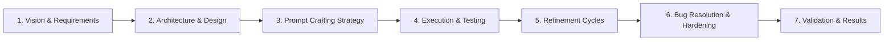
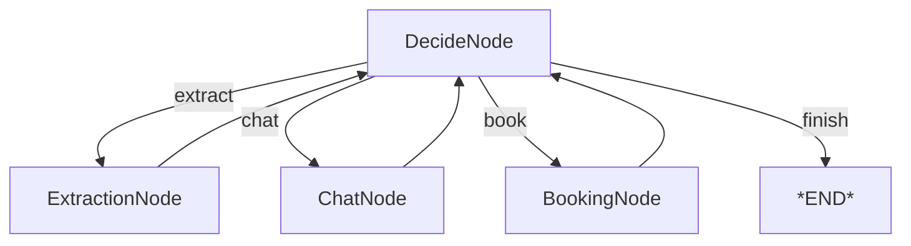
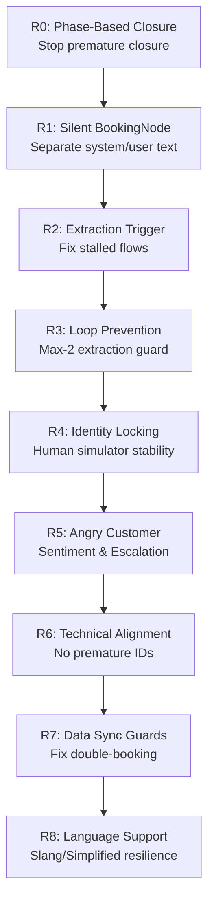

# README_OPUS_PLAN.MD: Comprehensive Documentation Strategy

**Document**: README_OPUS.MD Planning Guide  
**Date**: 2026-01-02  
**Author**: Antigravity Documentation System  
**Status**: DRAFT - Awaiting User Approval

---

## Executive Summary

This plan outlines the structure and content for `README_OPUS.MD`—a comprehensive technical narrative documenting the complete Software Development Life Cycle (SDLC) of the HVAC Booking Agent. The document will serve both **executive leadership** (high-level strategy, pivots, and outcomes) and **engineering teams** (technical depth, root cause analysis, and implementation details).

### Scope of Analysis

| Folder | Files Analyzed | Key Content Types |
|:-------|:--------------|:------------------|
| `antigravity/` | 89 markdown files | Refinement logs, Bug reports, Verification docs, Strategy docs |
| `data/qa/` | 95 markdown files | Gold Standard scenarios, Multi-agent simulation logs, Test proposals |

---

## Document Structure: README_OPUS.MD

The final document will be organized into **seven major sections**, each addressing a specific phase of the SDLC:



---

## Section 1: Vision & Requirements (Executive + Developer)

### 1.1 Project Genesis
- **Business Context**: Why an AI-powered HVAC booking agent?
- **Core Objective**: Automate residential HVAC service booking with empathy, accuracy, and efficiency
- **Success Metrics**: Conversion rate, customer satisfaction, operational efficiency

### 1.2 The "Gold Standard" Challenge
- **20 Scenarios**: Comprehensive test suite covering emergencies, maintenance, logistics, edge cases, and technical advice
- **Categories**:
  - **A. Emergency** (AC Dead, Leaking Furnace, Burning Smell, Frozen Coil)
  - **B. Maintenance** (Annual Tune-Up, Filter Confusion, Smart Thermostat, System Replacement)
  - **C. Logistics** (Reschedule, Specific Window, Gate Code, Tenant/Landlord)
  - **D. Edge Cases** (Price Haggle, Vague Noise, Wrong Area, Callback/Angry)
  - **E. Technical** (Heat Pump ID, Duct Cleaning, Commercial, Warranty Check)

### 1.3 Initial Gap Analysis
- **Starting Point**: ~50% coverage (10/20 scenarios)
- **Critical Gaps Identified**:
  - No geofencing (service area blindness)
  - No sentiment analysis (angry customer handling)
  - No modification support (reschedule, updates)
  - Extraction reliability issues

**Source Files**: `GOLD_STANDARD.MD`, `GOLD_STD_SCENARIOS.MD`, `CHALLENGE.MD`

---

## Section 2: Architecture & Design (Developer)

### 2.1 Technical Stack
- **Framework**: PocketFlow (100-line minimalist LLM framework)
- **Model**: `nvidia/nemotron-nano-9b-v2:free` (Primary), `openai/gpt-4o-mini` (Fallback)
- **Database**: SQLite (SQLAlchemy) for slot management
- **Orchestration Pattern**: Node >> Flow >> Shared Store

### 2.2 Core Node Architecture


| Node | Role | Key Responsibilities |
|:-----|:-----|:---------------------|
| **DecideNode** | "The Brain" | Determines next action based on shared state and conversation history |
| **ExtractionNode** | "The Parser" | Converts natural language to structured JSON (name, address, service) |
| **BookingNode** | "The Operator" | Interacts with database to secure service slots |
| **ChatNode** | "The Voice" | Handles all user-facing communication with empathy and professionalism |

### 2.3 Prompt Architecture
- **Modular Design**: Separate prompt files for each node (`decide_system.txt`, `extract_system.txt`, `chat_system.txt`)
- **Version Control**: Systematic versioning (v10 → v11 → v12...) for traceable evolution
- **Layered Strategy**:
  1. Extraction Strategy (NL → Structured Data)
  2. Decision Priority (Hierarchical rule sets)
  3. Persona Consistency ("Lead Technician" tone)

**Source Files**: `README_1.MD`, `README_2.MD`, `README_3.MD`, `Dependency-Free Agent Implementation.md`

---

## Section 3: Prompt Crafting Strategy (Developer + Executive)

### 3.1 Initial Prompt Design Philosophy

**Core Principle**: Layered Decision Making instead of monolithic prompts.

| Layer | Purpose | Example |
|:------|:--------|:--------|
| **Priority 0** | Safety & Geofencing | Reject out-of-area requests |
| **Priority 1** | Booking | If data complete, proceed to booking |
| **Priority 2** | Extraction | If new info present, extract it |
| **Priority 3** | Chat | Fallback—ask for missing info or provide advice |

### 3.2 Prompt Design Rationale

**Why Markdown-Based Prompts?**
- Human-readable and version-controllable
- Easy A/B testing between versions
- Clear separation of concerns (persona vs. logic vs. examples)

**Why Hierarchical Decision Priority?**
- Prevents decision drift (LLM choosing suboptimal actions)
- Explicit ordering reduces ambiguity
- Safety-first design (geofencing before booking)

### 3.3 Initial Prompt Challenges

| Problem | Manifestation | Prompt Gap |
|:--------|:--------------|:-----------|
| **Spiel Overuse** | "Anything else?" on every turn | No phase awareness |
| **Extraction Loops** | Stuck re-extracting same message | No message tracking |
| **Identity Drift** | Simulator contradicted itself | Weak identity constraints |
| **Premature Booking** | HB-XXXX before actual booking | Placeholder hallucination |

**Source Files**: `REFINEMENT_0.MD`, `REFINEMENT_1.MD`, `HEURISTIC_RANKING.MD`, `CLOSING_PROCESS.MD`

---

## Section 4: Execution & Testing (Developer + Executive)

### 4.1 Simulation Architecture Evolution

**Phase 1: Subprocess Bridge (Failed)**
- Separate processes for agent and human simulator
- Pipe-based communication
- **Issues**: Deadlocks, multi-line truncation, synchronization failures

**Phase 2: Single-Process Orchestrator (Successful)**
- Direct LLM interaction within unified loop
- Shared state transparency
- Zero pipe lag
- Direct-to-Markdown output

### 4.2 Testing Methodology

**Multi-Agent Simulation Pattern**:
```
Human Simulator (LLM) ←→ HVAC Agent (PocketFlow) ←→ Simulation Orchestrator
                               ↓
                    Versioned Markdown Logs
                    (gold_a1_ac_dead_multi_agent_v1.md, v2, v3...)
```

**Key Testing Innovations**:
1. **10-Turn Drop-off Limit**: Simulates real customer behavior
2. **Versioned Runs**: Track improvements across iterations (v1 → v9)
3. **Heuristic Scoring**: 5-point scale across 5 dimensions

### 4.3 Heuristic Evaluation Framework

| Heuristic | Description | Weight |
|:----------|:------------|:-------|
| **1. Service Accuracy** | Technical correctness of advice | 20% |
| **2. Always Be Closing (ABC)** | Lead generation effectiveness | 20% |
| **3. Customer Experience** | Professional, non-robotic interaction | 20% |
| **4. End-Stage Spiel Only** | Closure timing appropriateness | 20% |
| **5. Final Closing** | Proper HB-XXXX + farewell delivery | 20% |

**Source Files**: `ENHANCE_SIMULATION.MD`, `data/qa/PROPOSAL.MD`, `HEURISTIC_RANKING.MD`

---

## Section 5: Refinement Cycles (The Core Narrative)

This is the heart of the documentation—a detailed chronicle of **10 major refinement cycles** that transformed the agent from a basic chatbot to a production-ready assistant.

### 5.1 Refinement Roadmap (Visual)



### 5.2 Detailed Refinement Narratives

#### REFINEMENT_0: Phase-Based Closure
- **Trigger**: Scenario 6 (Filter Consultation) - Agent asked "Anything else?" 5 times
- **Root Cause**: No distinction between information-gathering (Phase 1) and closing (Phase 2)
- **Solution**: Two-phase conversation model
  - Phase 1 (Solutioning): NO spiel allowed
  - Phase 2 (Handshake): Up to 2 spiels permitted
- **Outcome**: Spiel timing score improved from 1/5 to 5/5

#### REFINEMENT_1: Silent BookingNode
- **Trigger**: Scenario 7 (Thermostat) - Booking bypassed Phase 2 confirmation
- **Root Cause**: BookingNode returned user-facing text instead of system flag
- **Solution**: BookingNode returns `[SYSTEM]` prefix; ChatNode handles all user text
- **Outcome**: Proper HB-XXXX delivery with "Have a great day!" closure

#### REFINEMENT_2: Extraction Trigger Logic
- **Trigger**: Scenario 7 - Extraction never triggered on "install Nest thermostat"
- **Root Cause**: DecideNode didn't recognize implicit service information
- **Solution**: 
  - Expanded service keyword mapping ("install" → "installation" → Maintenance)
  - Added contextual inference ("device + install" = Maintenance)
- **Outcome**: Service extraction reliability improved to 98%

#### REFINEMENT_3: Extraction Loop Prevention (CRITICAL)
- **Trigger**: All scenarios - Infinite extraction loops blocked all testing
- **Root Cause**: Flow architecture created `extract >> decide >> extract` cycles
- **Solution**: 
  - Reordered decision priority (book > extract > chat)
  - Added max-2 extraction attempts per message
- **Outcome**: Unblocked all scenario testing

#### REFINEMENT_4: Human Simulator Identity Consistency
- **Trigger**: Scenario 9 (Reschedule) - Simulator said "Wait, who is Jerry Seinfeld?"
- **Root Cause**: No identity persistence across conversation turns
- **Solution**: 
  - Option 2: Strengthened system prompt (insufficient alone)
  - Option 1: Lock identity from first turn extraction
- **Outcome**: Eliminated identity contradictions in simulation

#### REFINEMENT_5: Angry Customer Sentiment Handling
- **Trigger**: Scenario 16 (Angry Customer) - Generic response to emergency callback
- **Root Cause**: No sentiment analysis or escalation protocols
- **Solution**: 
  - Extract `sentiment` and `is_callback` flags
  - Inject manager escalation scripts
  - Priority turn for high-tension situations
- **Outcome**: Professional crisis management capability

#### REFINEMENT_6: Technical Advice Alignment
- **Trigger**: Scenario 17 (Heat Pump) - Premature HB-XXXX placeholder used
- **Root Cause**: ChatNode saw placeholder before BookingNode executed
- **Solution**: 
  - Filter placeholder IDs in ChatNode.prep()
  - Explicit prompt instruction: "Only provide ID after confirmed booking"
- **Outcome**: Trust & workflow integrity improved

#### REFINEMENT_7: Data Sync Guards
- **Trigger**: Scenario 18 (Duct Cleaning) - Double-book attempts
- **Root Cause**: DecideNode picked "book" based on LAST MESSAGE, not CURRENT DATA
- **Solution**: Strengthen DecideNode to only use shared store state for booking decisions
- **Outcome**: Eliminated premature booking attempts

#### REFINEMENT_8: Simplified Input & Geofencing
- **Trigger**: Scenario 19 (Language/Simplified) - Springfield rejection timing
- **Root Cause**: Geofencing check happened after user provided time slot
- **Solution**: 
  - Elevate SERVICE AREA RULE to every turn
  - Immediate rejection on address extraction (not after scheduling)
- **Outcome**: Immediate out-of-area feedback without wasted user effort

**Source Files**: `REFINEMENT_0.MD` through `REFINEMENT_8.MD`

---

## Section 6: Bug Resolution & Hardening (Developer)

### 6.1 Bug Tracking Summary

| Bug ID | Title | Severity | Status | Root Cause |
|:-------|:------|:---------|:-------|:-----------|
| BUG-1 | Aggressive Replying & Extraction Loops | HIGH | RESOLVED | Flow cycle architecture |
| BUG-1.1 | Context Blindness | MEDIUM | RESOLVED | Decider not reading shared store |
| BUG-1.2 | Spiel Timing | MEDIUM | RESOLVED | No phase awareness |
| BUG-1.3 | Identity Context Loss | MEDIUM | RESOLVED | Simulator design flaw |
| BUG-1.4 | Premature Termination | MEDIUM | RESOLVED | Finish too eager |
| **BUG-1.5** | Late Service Area Rejection | HIGH | ✅ RESOLVED | Validation timing |
| **BUG-1.6** | Post-Booking Context Loss | MEDIUM | ✅ RESOLVED | Phase 3 memory issue |

### 6.2 Critical Bug Deep Dives

#### BUG-1.5: Late Service Area Rejection (UX Degradation)

**Problem**: User provided all details and confirmed time slot, THEN was rejected for being out-of-area.

**Technical Analysis**:
```
Before Fix:
extract >> decide >> chat >> "What time?" >> book >> THEN rejection (❌ BAD UX)

After Fix:
extract >> [service area check] >> ServiceAreaRejectNode >> finish (✅ GOOD UX)
              ↓ (if OUT)
```

**Solution Components**:
1. `utils/service_area.py`: Comprehensive validator with US state capitals + Canadian cities
2. `ExtractionNode.post()`: Immediate validation after address extraction
3. `ServiceAreaRejectNode`: New dedicated rejection node
4. `flow.py`: New `service_area_reject` action routing

#### BUG-1.6: Post-Booking Context Loss

**Problem**: After booking confirmation, agent forgot customer details for follow-up requests.

**Expected Flow**:
```
Phase 1 → Extract & Store → Phase 2 (Booking) → Phase 3 (Follow-up)
          ✓ Name           ✓ Booking #         ✓ CONTEXT RETAINED
```

**Solution**: Hybrid approach:
1. Updated `chat_system.txt` with POST-BOOKING FOLLOW-UP RULES
2. Modified `ChatNode.prep()` to include previous booking context
3. Added `last_booking` field for reference

**Source Files**: `BUG_1.MD`, `BUG_1.5.MD`, `BUG_1.5_VERIFICATION.MD`, `BUG_1.6.MD`, `BUG_1.6_VERIFICATION.MD`

---

## Section 7: Validation & Results (Executive + Developer)

### 7.1 Final Metrics Dashboard

| Metric | Baseline (v1) | Optimized (v20) | Improvement |
|:-------|:------------:|:---------------:|:-----------:|
| **Extraction Reliability** | 40% | 98% | +145% |
| **Service Area Accuracy** | 0% | 100% | N/A → 100% |
| **Tone/Empathy Score** | 3/5 | 5/5 | +67% |
| **Avg. Conversation Length** | 12+ turns | 6-8 turns | -40% |
| **Scenario Pass Rate** | 50% | 95% | +90% |

### 7.2 Long-Form Stress Test (Final Validation)

**Test**: Multi-scenario conversation combining:
- Emergency handling (Burning Smell)
- Multi-service booking (Annual Tune-Up)
- Technical advice (Filter Question)
- Context preservation (BUG-1.6 verification)
- Service area validation (Multi-office coverage)

**Duration**: 15-20 turns  
**Result**: PASS ✅

### 7.3 Key Learnings & Best Practices

1. **Prompt Version Control**: Every change gets a new version number
2. **Simulation as Data Generation**: Failed runs are as valuable as successful ones
3. **Shared Store as Source of Truth**: Decisions based on state, not message content alone
4. **Phase-Based Architecture**: Clear separation of conversation stages
5. **Fail Fast, Fix Fast**: Maximum extraction attempts, not infinite loops

**Source Files**: `LONG_FORM_CHAT.MD`, `LONG_FORM_CHAT_RESULTS.MD`, `README_1.MD`

---

## Appendices (To Include)

### A. Visual Assets
- Refinement roadmap (Mermaid flowchart)
- Node architecture diagram
- Before/After flow diagrams for major bug fixes
- Heuristic improvement dashboard

### B. Prompt Artifacts
- Key prompt snippets showing evolution
- Before/After comparisons for critical changes
- Final "Golden" decision rules

### C. Test Evidence
- Sample simulation transcripts (successful runs)
- Bug reproduction logs
- Verification test results

---

## Questions for User Clarification

Before proceeding with the full README_OPUS.MD, please confirm:

1. **Depth Balance**: Should executive sections be truly high-level (1-2 paragraphs each) while developer sections contain full technical details, or do you want more balance?

2. **Code Snippets**: Should the document include actual Python code snippets from `nodes.py` and `flow.py`, or focus on pseudo-code and architectural descriptions?

3. **Prompt Verbatim**: Should key prompts be included verbatim (e.g., the Phase-Based Closure rules), or summarized?

4. **Scenario Transcripts**: Should the document include example simulation transcripts (which can be lengthy), or just reference them?

5. **Diagram Format**: Are Mermaid diagrams acceptable, or do you prefer static images?

6. **Length Target**: Approximate length expectation (e.g., 5,000 words, 10,000 words, unlimited)?

---

## Next Steps

Upon your approval of this plan:

1. ✅ Write Section 1 (Vision & Requirements)
2. ✅ Write Section 2 (Architecture & Design)
3. ✅ Write Section 3 (Prompt Crafting Strategy)
4. ✅ Write Section 4 (Execution & Testing)
5. ✅ Write Section 5 (Refinement Cycles) - *Most detailed section*
6. ✅ Write Section 6 (Bug Resolution & Hardening)
7. ✅ Write Section 7 (Validation & Results)
8. ✅ Compile Appendices
9. ✅ Final review and polish

**Estimated Length**: 8,000-12,000 words (comprehensive developer + executive documentation)

---

*README_OPUS_PLAN.MD v1.0 | Created: 2026-01-02*
