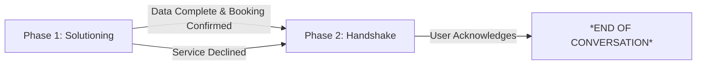

# Refinement 0: Phase-Based Closure & Spiel Timing Control

**Date**: 2026-01-01  
**Trigger**: Scenario 6 (Filter Consultation) - `gold_b6_filters_multi_agent_v4.md`  
**Status**: Implemented (Prompts v11), needs verification

---

## Problem Statement

The agent was **overusing the "Is there anything else I can help you with today?" spiel**, treating it as a **suffix** to every message rather than a **strategic closing transition**. This violated the heuristic requirement for spiel timing and created a robotic, intrusive customer experience.

### Observed Behavior (Scenario 6 v4):

```
Turn 1:
AI Agent: [Provides technical advice about filter size]
Is there anything else I can help you with today?

Turn 2:
AI Agent: [Answers urgency question]
Is there anything else I can help you with today?

Turn 3:
AI Agent: [Answers pricing question]
Is there anything else I can help you with today?

Turn 4:
AI Agent: [Answers scheduling question]
Is there anything else I can help you with today?

Turn 5:
AI Agent: [Answers technician experience question]
Is there anything else I can help you with today?
```

**Result**: 
- ❌ Spiel appeared **5 times** (violated max 2 rule)
- ❌ Spiel used during **active information gathering** (Phase 1)
- ❌ Created a "robotic" and "intrusive" experience

---

## Heuristic Evaluation (Scenario 6 v4)

Based on the evaluation criteria defined in `HEURISTIC_RANKING.MD`:

| Heuristic | Rank | Analysis |
|:---|:---:|:---|
| **1. Service Accuracy** | **5/5** | ✅ Correctly identified filter size (16x25x1) and provided legitimate technical context. |
| **2. Always Be Closing (ABC)** | **5/5** | ✅ Excellent. Successfully converted a "DIY advice" query into an $89 maintenance booking by Turn 8. |
| **3. Customer Experience** | **3/5** | ⚠️ While helpful and polite, the constant repetition of the closing spiel felt "robotic" and intrusive during the information-gathering phase. |
| **4. End-Stage Spiel Only** | **1/5** | ❌ **FAIL**. The agent used the spiel on Turn 1, 2, 3, 4, and 5. It was premature (during technical Q&A) and exceeded the "maximum twice" rule significantly. |
| **5. Final Closing** | **5/5** | ✅ The final turn followed the template perfectly: HB-XXXX number, "Have a great day", and the terminal signal. |

### **Overall Score**: 19/25 (76%) - **NEEDS IMPROVEMENT**

---

## Root Cause Analysis

### 1. **Spiel as a Suffix vs. Transition**

**Problem**: The `chat_system.txt` prompt (v10 and earlier) treated the spiel as a **generic suffix** to be appended to responses, rather than a **phase-specific transition**.

**Evidence from v10 prompt:**
```
3. ANYthing ELSE? SPIEL:
   - You MUST ask "Is there anything else I can help you with today?" 
     at least once if no booking is made.
   - Limit this spiel to a maximum of TWICE per conversation.
```

**Issue**: The prompt didn't specify **WHEN** to use the spiel, only **HOW MANY TIMES**. The LLM interpreted this as "use it as often as possible, up to 2 times," which led to overuse.

### 2. **Lack of Phase Awareness**

The agent had no concept of:
- **Phase 1 (Solutioning & Gathering Data)**: Focus on answering questions and collecting Name, Address, Service
- **Phase 2 (Final Handshake)**: Deliver confirmation and closure

Without this distinction, the agent couldn't determine when it was appropriate to start the "anything else" spiel.

### 3. **Premature Handshake Attempts**

In Turn 1, before even knowing if the user was interested in a service, the agent was already asking if they were done. This contradicted the "ABC" (Always Be Closing) goal by prematurely pushing the user toward the exit.

---

## Proposed Solution: Phase-Based Closure Logic

### **Concept: Two-Phase Conversation Model**



### **Phase 1: Solutioning & Gathering Data**
- **Goal**: Answer technical questions, offer service (ABC), and collect Name, Address, Service
- **Spiel Rule**: **FORBIDDEN**. Never ask "Is there anything else?" while gathering info.
- **Exit Condition**: Booking confirmed OR user explicitly declines service

### **Phase 2: Final Handshake**
- **Goal**: Deliver confirmation details and ensure no loose ends
- **Spiel Rule**: Ask "Is there anything else I can help you with today?" up to a **maximum of 2 times**
- **Exit Condition**: User acknowledges closure (e.g., "No thanks", "Goodbye")

---

## Implementation Strategy

### **Step 1: Define Phase-Based Rules in `chat_system.txt`**

**File**: `agent/prompts/chat_system.txt`

**New Structure (v11):**
```
CONVERSATION PHASES:
- PHASE 1 (Solutioning & Gathering Data): Booking Details (Name, Address, Service) are MISSING.
- PHASE 2 (Final Handshake): Booking is CONFIRMED or explicitly DECLINED.

STRICT RULES:

2. PHASE 1 - NO SPIEL ZONE:
   - If Service, Name, or Address is 'Missing', you are in PHASE 1.
   - PROHIBITED: Do NOT ask "Is there anything else I can help you with today?".
   - TASK: Answer questions, offer service (ABC), and ask FOR the missing info.

3. PHASE 2 - THE HANDSHAKE:
   - Enter Phase 2 ONLY if 'Booking Confirmed' is 'Yes' OR if the user has said 
     "No thanks/Goodbye" after your service offer.
   - Task: Provide HB- number (if booked), say "Have a great day!", and ask the spiel.
   - LIMIT: Maximum of 2 spiels per conversation.
```

**Key Changes:**
- ✅ Explicit **negative constraint**: No spiel in Phase 1
- ✅ Clear **trigger logic**: Only enter Phase 2 after booking confirmation or service decline
- ✅ **Maximum limit**: 2 spiels enforced

---

### **Step 2: Add Phase Awareness to `decide_system.txt`**

**File**: `agent/prompts/decide_system.txt`

**New Reasoning Rule (v11):**
```
Reasoning Rule:
- When reasoning, categorize the conversation state as Phase 1 (Solutioning/Gathering info) 
  or Phase 2 (Closing Handshake).
- Do not trigger 'finish' if the user is still in Phase 1 (providing booking data).
```

**Key Changes:**
- ✅ DecideNode now explicitly tracks conversation phase
- ✅ Prevents premature `finish` during Phase 1

---

### **Step 3: Clarify Strict Trigger Logic**

**Concept**: The "Anything Else" spiel is a **Closing Transition**, not a generic suffix.

**Strict Trigger Logic** means:
- The spiel should only be issued when the agent believes the **primary intent** (Booking or Information) has been satisfied.
- If the agent is currently asking for an Address to complete a booking, it is **Phase 1** and the spiel must be omitted.
- If the agent has provided the filter size and the user says "Thanks!", the agent enters **Phase 2**, asks the spiel, and waits for a final "Bye" before hitting `*END OF CONVERSATION*`.

**Example Flow (Correct):**
```
Phase 1:
Turn 1: User asks about filter size
Turn 2: Agent provides technical answer + offers service (ABC)
Turn 3: User asks about pricing
Turn 4: Agent provides pricing + asks for Name/Address
Turn 5: User provides details
Turn 6: Agent books (if accepted) or acknowledges DIY choice

Phase 2:
Turn 7: Agent delivers HB-XXXX (if booked) OR "No problem" (if DIY)
        + "Have a great day! Is there anything else I can help you with today?"
Turn 8: User says "No thanks"
Turn 9: Agent says "*END OF CONVERSATION*"
```

---

## Implementation Checklist

- [x] **Version prompts** (Created v11 backups)
- [x] **Update `agent/prompts/chat_system.txt`**: Implement Phase 1 vs Phase 2 rules
- [x] **Update `agent/prompts/decide_system.txt`**: Add phase-aware reasoning
- [x] **Create `HEURISTIC_RANKING.MD`**: Document evaluation framework
- [ ] **Re-run Scenario 6 (v5+)**: Verify spiel only appears in Phase 2
- [ ] **Heuristic Check**: Ensure score improves to 4/5 or 5/5 on "End-Stage Spiel Only"

---

## Success Criteria

### **Scenario 6 (Filter Consultation) should show:**

```
Phase 1 (Turns 1-5):
- Agent answers filter size question
- Agent offers ABC service
- Agent answers pricing, urgency, technician questions
- NO "Is there anything else?" spiel

Phase 2 (Turns 6-7):
- User decides (booking OR DIY)
- Agent delivers appropriate closure:
  - IF booking: "HB-XXXX. Have a great day! Is there anything else?"
  - IF DIY: "No problem. Have a great day! Is there anything else?"
- User acknowledges
- Agent: "*END OF CONVERSATION*"
```

### **Heuristic Scores (Target):**
| Heuristic | Target | Current |
|:---|:---:|:---:|
| Service Accuracy | 5/5 | 5/5 ✅ |
| ABC (Always Be Closing) | 5/5 | 5/5 ✅ |
| Customer Experience | 5/5 | 3/5 ⚠️ |
| **End-Stage Spiel Only** | **5/5** | **1/5** ❌ |
| Final Closing | 5/5 | 5/5 ✅ |

**Overall Target**: 25/25 (100%)

---

## Related Documents

- **Heuristic Framework**: `HEURISTIC_RANKING.MD`
- **Closure Protocol**: `CLOSING_PROCESS.MD`
- **Prompt Versions**: 
  - Before: `agent/prompts/*_v10.txt`
  - After: `agent/prompts/*_v11.txt`
- **Test Scenario**: `data/qa/gold_b6_filters.md`
- **Failed Runs**: 
  - `data/qa/multi_agent/gold_b6_filters_multi_agent_v4.md` (spiel overuse)
- **Verification Needed**: Scenario 6 v5+ with v11 prompts

---

## Notes

This refinement is **foundational** for all future scenarios. The Phase-Based Closure model ensures:
1. **Phase 1**: Professional information gathering without premature closure attempts
2. **Phase 2**: Polite, complete handshake with confirmation details and strategic spiel use
3. **Consistent Experience**: Applies to both booking-confirmed and service-declined paths

The success of this refinement will be verified in subsequent scenario dry runs.
