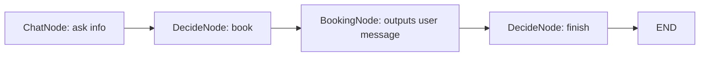
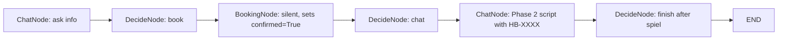

# Refinement 1: Silent BookingNode & Phase 2 Handshake

**Date**: 2026-01-01  
**Trigger**: Scenario 7 (Thermostat Installation) - `gold_b7_thermostat_multi_agent_v2.md`  
**Status**: Identified, awaiting implementation

---

## Problem Statement

The agent is **bypassing Phase 2 closure protocol** after successful bookings, resulting in incomplete confirmation messages and missing the required "HB-XXXX" confirmation number and "Have a great day!" closing.

### Observed Behavior (Scenario 7 v2):

```
Turn 2:
AI Agent (Action: book): Success! Verified and booked for Sarah Jenkins on 2026-01-02 14:00.

Turn 3:
AI Agent (Action: finish): *END OF CONVERSATION*
```

### Expected Behavior:

```
Turn 2:
AI Agent (Action: book): [SILENT - system sets confirmed=True]

Turn 3:
AI Agent (Action: chat): Success! You're all set for your Maintenance visit. 
Your booking confirmation number is: HB-3947. Have a great day! 
Is there anything else I can help you with today?

Turn 4 (if user says "No thanks"):
AI Agent (Action: finish): *END OF CONVERSATION*
```

---

## Root Cause Analysis

### 1. **Architectural Issue: BookingNode is User-Facing**

The `BookingNode` currently returns a **user-facing message**:
```python
# agent/nodes.py (lines 208-217)
return f"Success! Verified and booked for {user['name']} on {slot_time}."
```

This message:
- ❌ Bypasses `ChatNode` (which should handle ALL user-facing text)
- ❌ Lacks the HB-XXXX confirmation number
- ❌ Lacks the "Have a great day!" + spiel
- ❌ Does NOT follow the Phase 2 script in `chat_system.txt`

### 2. **Flow Breakdown**

**Current (Incorrect) Flow:**


**Expected (Correct) Flow:**


### 3. **ChatNode is Phase-Aware BUT Not Applied**

The `chat_system.txt` (v11) defines Phase 2:
```
PHASE 2 (Booking Confirmed: Yes):
- SCRIPT: "Success! You're all set for your [Service] visit. 
  Your booking confirmation number is: HB-[4 digits]. 
  Have a great day! Is there anything else I can help you with today?"
```

However, this prompt **is never reached** because the BookingNode returns text directly to the user, and the DecideNode immediately picks `finish`.

---

## Heuristic Violations

| Heuristic | Expected | Actual | Impact |
|:---|:---|:---|:---|
| **Service Accuracy** | $129 pricing mentioned | Vague "I'll need address for pricing" | 2/5 |
| **Phase 2 Script** | HB-XXXX + "Have a great day" + spiel | `*END OF CONVERSATION*` only | 1/5 |
| **Customer Experience** | Professional confirmation | Abrupt system message | 3/5 |

---

## Proposed Solution

### **Step 1: Make BookingNode Silent (System-Only)**

**File**: `agent/nodes.py` (BookingNode.exec)

**Current (lines 208-217):**
```python
# MOCK BOOKING (SQLite disabled due to locking issues)
import random
import datetime

# Generate mock booking details
tomorrow = (datetime.datetime.now() + datetime.timedelta(days=1)).strftime("%Y-%m-%d")
slot_time = f"{tomorrow} 14:00"

return f"Success! Verified and booked for {user['name']} on {slot_time}."
```

**Proposed:**
```python
# MOCK BOOKING (SQLite disabled due to locking issues)
import random
import datetime

# Generate mock booking details
tomorrow = (datetime.datetime.now() + datetime.timedelta(days=1)).strftime("%Y-%m-%d")
slot_time = f"{tomorrow} 14:00"

# SILENT BOOKING - return system flag, not user-facing text
return f"[SYSTEM] Booking confirmed for {user['name']} on {slot_time}."
```

**Rationale**: 
- The `[SYSTEM]` prefix signals this is NOT for the user
- The `ChatNode` will see `confirmed=True` and handle the user-facing Phase 2 script
- This separates concerns: BookingNode = backend logic, ChatNode = user messaging

---

### **Step 2: Update ChatNode Prompt to Check Confirmed Status**

**File**: `agent/prompts/chat_system.txt` (current v11)

**Current Phase 2 Rule:**
```
PHASE 2 (Booking Confirmed: Yes):
- SCRIPT: "Success! You're all set for your [Service] visit. 
  Your booking confirmation number is: HB-[4 digits]. 
  Have a great day! Is there anything else I can help you with today?"
```

**Add Trigger Logic:**
```
PHASE 2 TRIGGER:
- If you see 'Booking Confirmed: Yes' in the CURRENT DATA, you MUST use the Phase 2 script.
- Generate a random 4-digit HB number (e.g., HB-3947).
- Replace [Service] with the actual service type (e.g., "Maintenance", "Repair").
```

**Rationale**: 
- Makes it explicit that the `ChatNode` should check the `confirmed` flag
- Ensures the LLM generates the HB-XXXX number consistently

---

### **Step 3: Update DecideNode to Route to ChatNode After Booking**

**File**: `agent/prompts/decide_system.txt` (current v11)

**Current Rule:**
```
1. 'book': Use this IMMEDIATELY if Name, Address, and Service are ALL present and 'Booking Confirmed' is No.
```

**Proposed Addition:**
```
POST-BOOKING RULE:
- After 'book' action completes, if 'Booking Confirmed' changes to 'Yes', 
  you MUST pick 'chat' on the NEXT turn to deliver the Phase 2 confirmation script.
- Do NOT pick 'finish' immediately after 'book'.
```

**Rationale**: 
- Ensures the DecideNode always routes back to ChatNode for Phase 2 delivery
- Prevents premature `finish` action

---

## Implementation Checklist

- [ ] **Version prompts** (run `python3 agent/prompts/version_prompts.py`)
- [ ] **Modify `agent/nodes.py`**: Update BookingNode.exec to return `[SYSTEM]` flag
- [ ] **Update `agent/prompts/chat_system.txt`**: Add explicit Phase 2 trigger logic
- [ ] **Update `agent/prompts/decide_system.txt`**: Add post-booking routing rule
- [ ] **Re-run Scenario 7**: Verify Phase 2 script is delivered
- [ ] **Heuristic Check**: Ensure HB-XXXX appears and "Have a great day!" is used

---

## Success Criteria

### **Scenario 7 (Thermostat Installation) should show:**

```
Turn 2:
Human: My name is Sarah Jenkins and the address is 123 Maple Lane...

Turn 3:
AI Agent (Action: book): [SYSTEM] Booking confirmed for Sarah Jenkins on 2026-01-02 14:00.

Turn 4:
AI Agent (Action: chat): Success! You're all set for your Maintenance visit. 
Your booking confirmation number is: HB-3947. Have a great day! 
Is there anything else I can help you with today?

Turn 5:
Human: No thanks.

Turn 6:
AI Agent (Action: finish): *END OF CONVERSATION*
```

### **Heuristic Scores:**
- Service Accuracy: 5/5 (pricing provided)
- Phase 2 Script: 5/5 (HB-XXXX + "Have a great day" + spiel)
- Customer Experience: 5/5 (professional, complete confirmation)
- Spiel Timing: 5/5 (appears in Phase 2 only, max 2 times)

---

## Related Documents

- **Heuristic Framework**: `HEURISTIC_RANKING.MD`
- **Closure Protocol**: `CLOSING_PROCESS.MD`
- **Prompt Versions**: `agent/prompts/*_v11.txt` → `*_v12.txt` (after this refinement)
- **Test Scenario**: `data/qa/gold_b7_thermostat.md`
- **Failed Run**: `data/qa/multi_agent/gold_b7_thermostat_multi_agent_v2.md`
