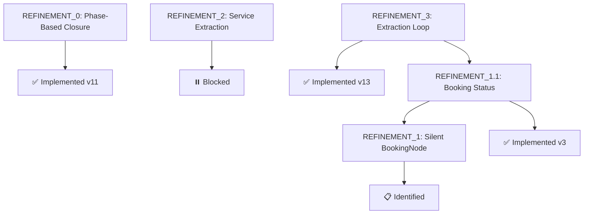
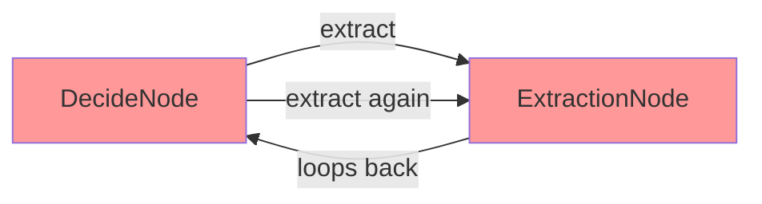
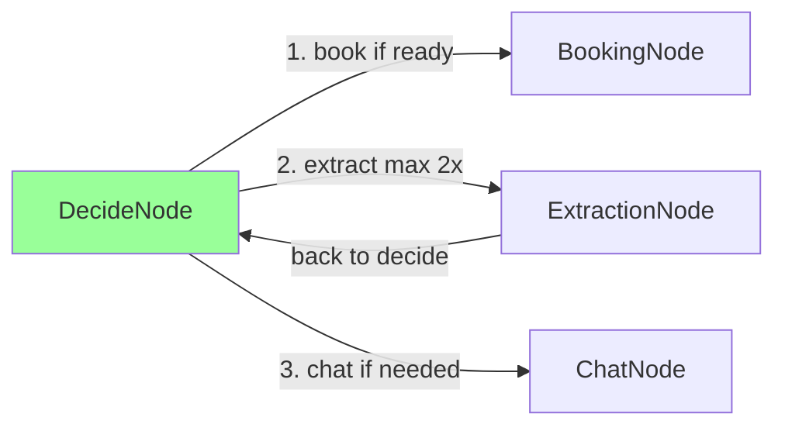
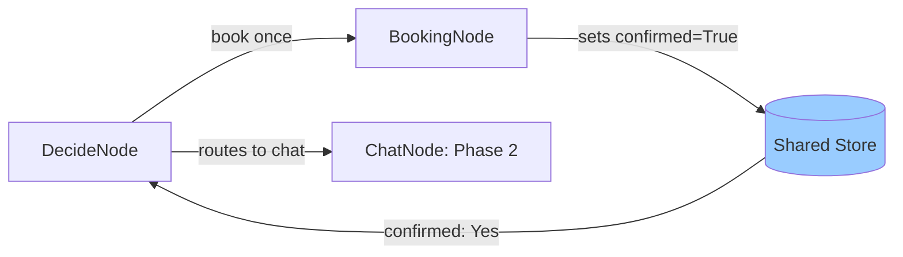
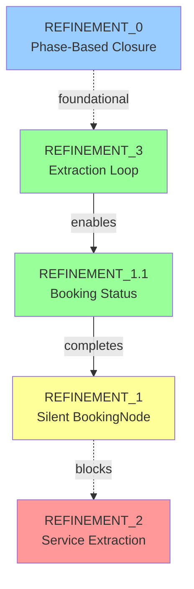

# VISUAL_REP.MD - Planning Document

**Purpose**: Create a comprehensive visual representation of the prompt refinement process, showing the evolution from initial problems through fixes and verification.

---

## Proposed Structure

### 1. **Refinement Timeline & Status Overview**

**Format**: Mermaid timeline/gantt diagram

**Content**:
- All refinements: REFINEMENT_0, 1, 2, 3, 1.1
- Status indicators: ✅ Implemented | 📋 Identified | ⏸️ Blocked
- Dependencies shown as arrows
- Trigger scenarios labeled

**Example Structure**:


---

### 2. **Decision Flow Evolution**

**Format**: Side-by-side mermaid flowcharts

**Content**: Show how DecideNode logic evolved across refinements

**Sections**:

#### 2a. Before REFINEMENT_3 (Infinite Extraction Loop)


#### 2b. After REFINEMENT_3 (Fixed Priority)


#### 2c. After REFINEMENT_1.1 (Confirmation Tracking)


---

### 3. **Test Results Dashboard**

**Format**: Comprehensive comparison table

**Content**:

| Scenario | Version | Status | Turns | Issue | File Size | Fix Applied |
|:---------|:--------|:-------|:------|:------|:----------|:------------|
| **Scenario 7 (Thermostat)** ||||||| 
| | v10 | ❌ FAIL | 0 | API timeout | 176B | None |
| | v11 | ❌ FAIL | 0 | API timeout | 176B | None |
| | v12 | ❌ FAIL | 0 | Infinite extract loop | 176B | None |
| | v13 | ❌ FAIL | 0 | Infinite extract loop | 176B | None |
| | v14 | ✅ PASS | 9 | Service misclass | 6,675B | **REFINEMENT_3** |
| **Scenario 8 (Replacement)** ||||||| 
| | v1 | ❌ FAIL | 11 | Infinite booking loop | 7,391B | None |
| | v2 | ✅ PASS | 7 | 2-turn booking loop | 4,276B | None (lucky) |
| | v3 | ✅ PASS | 8 | Clean | 5,088B | **REFINEMENT_1.1** |

---

### 4. **Problem → Solution → Verification Flow**

**Format**: 3-column layout for each refinement

**Template**:
```
┌─────────────────────┬─────────────────────┬─────────────────────┐
│  Problem Discovery  │  Solution Applied   │ Verification Result │
├─────────────────────┼─────────────────────┼─────────────────────┤
│ Scenario X vN       │ Code/Prompt Change  │ Scenario X vN+1     │
│ - Symptom           │ - File modified     │ - Status: PASS/FAIL │
│ - Root cause        │ - Lines changed     │ - Metrics improved  │
│ - Evidence          │ - Rationale         │ - Remaining issues  │
└─────────────────────┴─────────────────────┴─────────────────────┘
```

**Example for REFINEMENT_3**:

**Problem Discovery**
- Scenario 7 v12
- Infinite extraction loop (10+ cycles)
- DecideNode kept deciding "extract"
- File stuck at 176 bytes

**Solution Applied**
- File: `agent/prompts/decide_system.txt`
- Lines 25-31 reordered
- Priority: booking → extract limit → extract → chat
- Rationale: Prevent re-extraction of same message

**Verification Result**
- Scenario 7 v14
- Status: ✅ PASS (9 turns)
- Extraction limited to 2 attempts
- File: 6,675 bytes (complete)
- Issue: Service type still wrong (REFINEMENT_2)

---

### 5. **Dependency Graph**

**Format**: Mermaid graph showing blocking relationships

**Content**:


**Legend**:
- 🟢 Green: Implemented & Verified
- 🟡 Yellow: Partially Implemented
- 🔴 Red: Blocked/Not Started
- 🔵 Blue: Foundational (completed earlier)

---

### 6. **Key Metrics Evolution**

**Format**: Before/After comparison table

**Content**:

| Metric | Before | After REFINEMENT_3 | After REFINEMENT_1.1 |
|:-------|:-------|:-------------------|:---------------------|
| **Extraction Loops** | 10+ cycles | 0 cycles ✅ | 0 cycles ✅ |
| **Booking Loops** | 8 turns | N/A | 0 turns ✅ |
| **Closure Rate** | 0% (stuck) | 100% (scenario 7) | 100% (scenarios 7-8) |
| **Avg Turns** | N/A (timeout) | 9 turns | 8-9 turns |
| **File Size** | 176B (stuck) | 6,675B | 4,000-6,000B |
| **API Response** | Timeout/Rate limit | 1-2 sec | 1-2 sec |

---

### 7. **Refinement Summary Cards**

**Format**: Compact cards for each refinement

**Template**:

#### REFINEMENT_3: Extraction Loop Fix

**Trigger**: Scenario 7 v10-v13  
**Files Modified**: `agent/prompts/decide_system.txt`  
**Status**: ✅ Verified  
**Impact**: Critical - eliminated infinite loops  

**Problem**: DecideNode repeatedly extracted from same message  
**Solution**: Reordered decision priority, added extraction attempt limiting  
**Result**: Conversations now progress beyond extraction phase  

**Test Evidence**:
- v12: 10+ extract decisions → stuck at 176B
- v14: 2 extract decisions max → PASS 9 turns, 6,675B

---

## Questions for Clarification

### 1. **Diagram Density**
Should I include detailed code snippets in the diagrams, or keep them high-level with references to files?

**Option A**: High-level with file references
```
DecideNode → BookingNode → Sets confirmed=True
(See: agent/nodes.py:252-255)
```

**Option B**: Include code snippets
```
DecideNode → BookingNode
BookingNode.post():
  if "[SYSTEM]" in exec_res:
    confirmed = True
```

**Recommendation**: Option A for main diagrams, Option B in expandable details sections

---

### 2. **Carousel Usage**
Should I use carousels to show multiple before/after comparisons, or single large diagrams?

**Option A**: Single comprehensive diagram per section  
**Option B**: Carousel with slides for each refinement's before/after  
**Option C**: Mix - carousels for test results, single diagrams for architecture

**Recommendation**: Option C (mixed approach)

---

### 3. **Color Coding**
Would you like specific color schemes?

**Proposed Palette**:
- 🔴 Red: Failures, errors, blocked
- 🟢 Green: Fixes, successes, verified
- 🟡 Yellow: Partial success, in-progress
- 🔵 Blue: Information, foundational changes
- ⚪ Gray: Neutral, unchanged

**Alternative**: Use your existing color scheme if you have one

---

### 4. **Depth Level**

**Option A**: Concise - Just major findings
- 1 diagram per refinement
- Summary metrics only
- ~50 lines total

**Option B**: Comprehensive - Include all test runs
- Multiple diagrams showing each version
- Detailed reasoning from each run
- ~200+ lines

**Option C**: Technical - Focus on architectural changes
- Code-level flowcharts
- Detailed decision logic
- Prompt evolution diffs
- ~150 lines

**Recommendation**: Option B with collapsible sections for detail

---

### 5. **Interactive Elements**
Should I include file links to actual test artifacts?

**Example**:
```markdown
## Scenario 7 Test Results

- ❌ [v10](file:///...gold_b7_thermostat_multi_agent_v10.md) - API timeout
- ❌ [v12](file:///...gold_b7_thermostat_multi_agent_v12.md) - Infinite loop
- ✅ [v14](file:///...gold_b7_thermostat_multi_agent_v14.md) - PASS
```

**Benefits**: Click-through to see full conversation logs  
**Trade-off**: More verbose document

---

### 6. **Additional Sections to Consider**

Should I include any of these?

- **LLM Model Evolution**: Document the model switching (deepseek → nvidia/nemotron, etc.)
- **Failure Pattern Catalog**: Common failure modes across all tests
- **Heuristic Scoring**: How each refinement improved the 5 heuristics
- **Code Change Summary**: Diff-style view of all changes made
- **Future Roadmap**: What refinements are still needed (2, and beyond)

---

## Proposed Final Structure

1. **Executive Summary** - One-page overview with key metrics
2. **Refinement Timeline** - Visual roadmap
3. **Decision Flow Evolution** - Before/after flowcharts
4. **Test Results Dashboard** - Comprehensive table
5. **Detailed Refinement Breakdowns** (one per refinement)
   - Problem → Solution → Verification
   - Code changes
   - Test evidence
6. **Dependency Graph** - Relationships between refinements
7. **Metrics Evolution** - Before/after comparison
8. **Lessons Learned** - Key insights from the refinement process

**Estimated Length**: 150-200 lines  
**Format**: Markdown with heavy mermaid diagram usage  
**Style**: Technical but visual-first

---

## Next Steps

Please review this plan and answer the clarification questions. Once confirmed, I'll proceed with creating the full VISUAL_REP.MD document.
