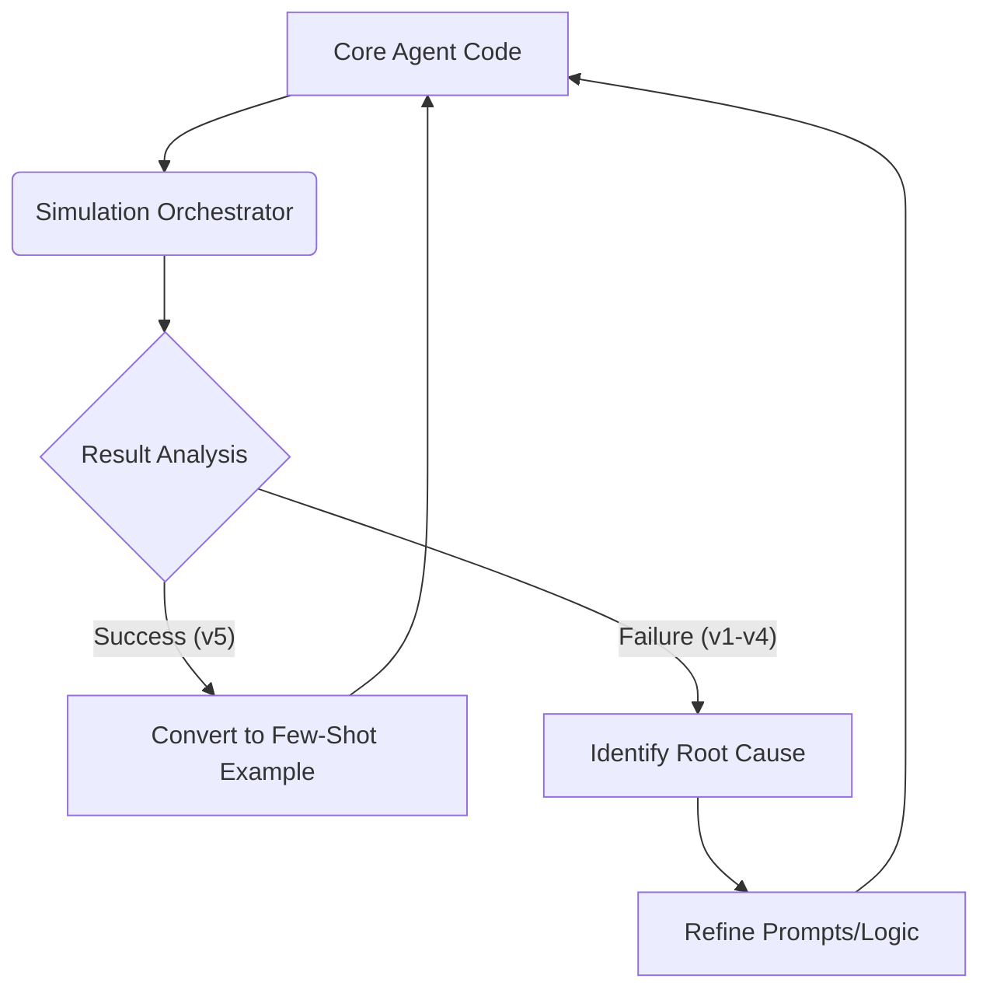

# ENHANCE_SIMULATION.MD: The Simulation-to-Agent Feedback Loop

This document outlines the strategy for using multi-agent simulations (located in `data/qa/multi_agent/`) to systematically improve the performance, reliability, and naturalness of the core HVAC Booking Agent.

## 1. The Core Philosophy
Simulations are **not just tests**; they are **data generators**. By running the agent against a tireless "Human Simulator," we can identify failure patterns and "AI-isms" that manual testing might miss.

## 2. Phase 1: Foundation Implementation (Current)

We have implemented the following key updates to establish a representative and measurable simulation environment:

### A. Centralized Prompt Management
- **Context**: Previously, prompts were hardcoded across multiple classes in `agent/nodes.py`.
- **Update**: All system prompts and few-shot examples are now centralized in `agent/prompts/`.
- **Benefit**: Allows for rapid iteration of agent personality and logic without touching core code.

### B. Few-Shot Learning Injection
- **Context**: The agent needed a "Gold Standard" reference for tone and efficiency.
- **Update**: Successfully injected the `v5` Scenario 3 simulation log into the `ChatNode`.
- **Benefit**: Grounds the agent's behavior in a verified, high-quality conversation transcript.

### C. State-Aware Decision Logic
- **Context**: The agent often looped because it didn't "know" it had finished a booking.
- **Update**: Added a `confirmed` flag to the shared store via `BookingNode`. The `DecideNode` now explicitly checks this flag.
- **Benefit**: Ensures the agent decisively moves to the `finish` state once the transaction is complete.

### D. Strict 10-Turn "User Drop-off" Simulation
- **Context**: Real users often leave conversations before formal closure.
- **Update**: The orchestrator now strictly terminates at the 10th turn, reporting the outcome as `DROPPED/NO CLOSURE`.
- **Rationale**: This simulates actual customer behavior and forces us to optimize the agent for **speed-to-closure**.

### E. Natural Closure & Simplified Handshake
- **Context**: Conversations often ended in loops due to over-politeness.
- **Update**: 
    - **Closing Spiel**: Once a booking is confirmed, the `ChatNode` asks: *"Is there anything else I can help you with?"*
    - **Terminal Signal**: If the user acknowledges or says they are set, the agent responds with `*END OF CONVERSATION*`.
    - **DecideNode**: Immediately triggers `finish` upon detecting user acknowledgment post-booking.
- **Benefit**: Prevents loops and clearly signals the end of the simulation for both humans and processors.

## 3. The Systematic Workflow

1.  **Simulate**: Run `simulation_orchestrator.py` for a target scenario.
2.  **Evaluate**: Grade the run based on the **Simulation Report**:
    - **Status**: Did it PASS (Closure) or was it DROPPED?
    - **Turns**: Is it trending toward the 10-turn limit?
3.  **Refine**: 
    - Adjust `agent/prompts/` for tone/persona.
    - Adjust `agent/nodes.py` if state-tracking fails.
4.  **Verify**: Rerun and version the output (e.g., `v8 -> v9`).

## 4. Future Roadmap
- **Phase 2 Implementation Plan**:
    - **Confirmed State**: Update `BookingNode` to set a persistent `confirmed: True` boolean in the shared state upon successful scheduling.
    - **Closure Handshake Protocol**: 
        1. Agent confirms booking + asks "anything else?" (Closing Spiel).
        2. Human responds (e.g., "No thanks").
        3. `DecideNode` detects closure and selects `finish`.
        4. Agent says "Have a great day!" and terminates.
    - **Prompt Tuning**: Inject few-shot examples of this specific handshake into `agent/prompts/chat_examples.txt`.

- **Batch Processing**: Automating closure detection across all 20 Gold Standard scenarios using `batch_run_simulations.py`.
- **Dynamic Persona**: Adjusting the agent's empathy level based on the `urgency` detected in the `ExtractionNode`.
