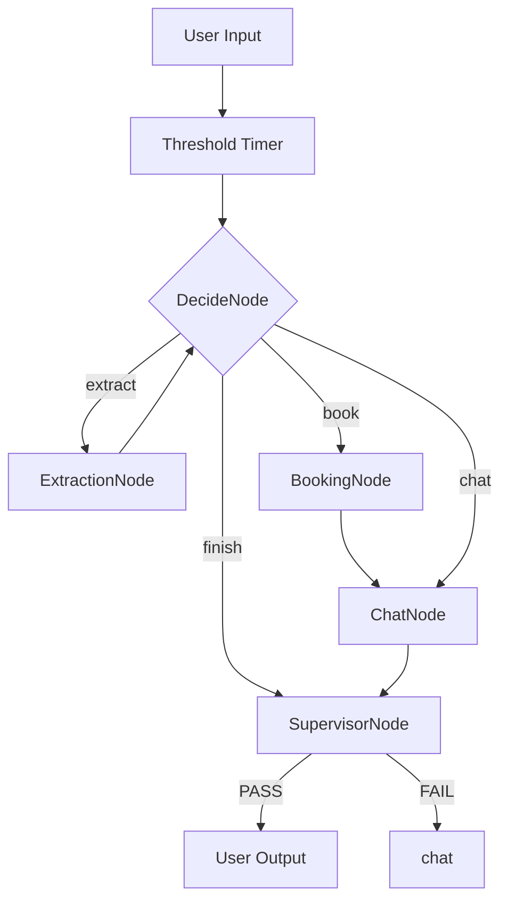

# PATTERN_STRATEGY_V2.MD: Comprehensive Bug Resolution Protocol

**Version**: 2.0 (Industrial Strength)
**Date**: 2026-01-02
**Objective**: Resolve all identified defects (BUG_1.1 through BUG_1.6) using standard PocketFlow Design Patterns.

---

## 1. Unified Pattern Architecture

We will move from a linear flow to an **Agentic-Guardrail** architecture.

---

## 2. Solution Mapping (Root Cause -> Pattern)

### A. Context Blindness (BUG_1.4)
- **Pattern**: **Context Management (Minimalist Context)**
- **Strategy**: 
    - Strip "System Noise" from the history before passing it to `DecideNode`.
    - Only pass the `user_info` and `booking_info` as distinct JSON objects, NOT as part of the raw history.
    - **Implementation**: Refine `DecideNode.prep` to filter internal handover messages.

### B. Premature Termination (BUG_1.6)
- **Pattern**: **Thinking (Closure Verification)**
- **Strategy**: 
    - Implement a "Double-Check" thinking step in `DecideNode`.
    - **Rule**: If `action == finish`, verify if `last_msg` contains any question marks or "Wait/Hold" keywords.
    - **State**: Add `shared["closure_confirmed"] = False`. The agent must ask "Is there anything ELSE?" and receive a clear "No" before setting this to `True`.

### C. Handover Leak (BUG_1.3)
- **Pattern**: **Supervisor (Gatekeeper)**
- **Strategy**:
    - Centralize `shared["last_response"]` updates in a dedicated `SupervisorNode`.
    - **Logic**: If the content starts with `[SYSTEM]`, the Supervisor silences it and loops back to `ChatNode`.
    - This ensures NEVER showing internal flags to the user.

### D. Safety Blindness (BUG_1.5)
- **Pattern**: **Thinking (Step-by-Step Reasoning)**
- **Strategy**:
    - Update `ChatNode` to perform a "Safety Audit" on every turn.
    - **Prompt**: "1. Did user ask for safety? 2. Is there a booking? 3. Combine both."
    - This prevents the LLM from ignoring safety instructions due to "Success!" script tunnel vision.

---

## 3. The "Once and For All" Implementation Plan

1. **Phase A (Nodes)**:
    - [ ] `nodes.py`: Harden `SupervisorNode` with regex for system tag stripping.
    - [ ] `nodes.py`: Add `ClosureSentry` to `DecideNode`.
    - [ ] `nodes.py`: Implement `ContextFilter` in `DecideNode.prep`.

2. **Phase B (Prompts)**:
    - [ ] `decide_system.txt`: Add explicit "Uncertainty Detection" rules.
    - [ ] `chat_system.txt`: Move "Success!" script to a conditional block that ONLY fires if `Phase 2 Delivered` is False.

3. **Phase C (Flow)**:
    - [ ] `flow.py`: Ensure ALL outcomes from `chat` and `book` terminate at `supervisor`.

---
*Created by Antigravity on 2026-01-02*
