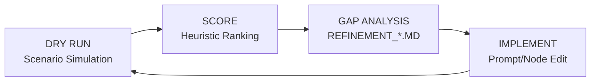

# HVAC Booking Agent: Evolution, Frameworks & Refinement

This document serves as the master technical documentation for the AI-powered HVAC Booking Agent. It details the architecture, the rigorous testing frameworks used for validation, and the iterative refinement process that led to its production-ready state.

---

## 1. Project Overview & Architecture

The agent is an orchestrator built on the **PocketFlow** framework, designed to handle high-stakes customer service interactions with empathy and technical precision.

### The "Brain" (Nodes)
- **DecideNode**: Context-aware router using a hierarchical rule set.
- **ExtractionNode**: NLP parser that transforms varied user inputs into structured JSON.
- **BookingNode**: Database operator for slot management and persistent storage.
- **ChatNode**: The persona layer, delivering professional, empathetic communication.

---

## 2. The Gold Standard Framework: Stress-Testing the Edge

The "Gold Standard" is a benchmark of **20 foundational scenarios** that define the full taxonomy of the HVAC field service industry. Unlike basic unit tests, these are long-form conversational threads designed to stress-test the agent's logic, empathy, and technical routing.

### Scenario Taxonomy
The 20 scenarios are categorized into five critical stress-test areas:

| Category | Goal | Key Edge Case |
|:--- |:--- |:--- |
| **A: Emergency Protocols** | Enforce safety and immediate technician dispatch. | **Scenario 3 (Burning Smell)**: Must prioritize safety over data collection. |
| **B: Technical Maintenance** | Accurate mapping of symptoms to service types. | **Scenario 6 (Filter Confusion)**: Distinguish advice vs. booking intent. |
| **C: Logistics & Context** | Handle property constraints and rescheduling. | **Scenario 11 (Gate Codes)**: Context retention for service notes. |
| **D: Conflict Resolution** | Handle pricing objections and service boundaries. | **Scenario 13 (Price Haggle)**: Empathetic de-escalation without loss of profit. |
| **E: Technical Resiliency** | Identify specialized hardware (Heat Pumps, Ducting). | **Scenario 17 (Heat Pump)**: Routing to specialized specialists. |

---

## 3. Heuristic Ranking: The Objective Measuring Stick

To avoid subjective evaluation, every refinement cycle starts with a **Heuristic Ranking**. This framework scores the agent across five immutable business pillars:

### The 5 Pillars of HVAC CX
| Heuristic | Objective | Success Metric |
|:--- |:--- |:--- |
| **1. Service Accuracy** | Correct service identification. | Accurate `service_type` in JSON store. |
| **2. Always Be Closing (ABC)** | Conversion-focused interaction. | Booking attempt made when all data is present. |
| **3. Customer Experience (CX)** | Empathy and tone. | Sentiment analysis passes "professional/empathetic" check. |
| **4. End-Stage Spiel Only** | Strategic closing logic. | "Is there anything else?" appears ONLY in Phase 2. |
| **5. Great Day Closing** | Branded parting message. | "HB-XXXX + Have a great day" delivered upon closure. |

---

## 4. The "Antigravity" Refinement Cycle

The agent didn't start perfect; it was forged through the **Antigravity Refinement Cycle**:

### Case Study: The "Robotic Loop" (Refinement 0)
- **Problem**: The agent failed Heuristic #4 (Spiel Placement), asking "Anything else?" after every sentence.
- **Root Cause**: Universal suffix instruction in `chat_system.txt`.
- **Solution**: Implemented **Phase-Based Logic**.
  - **Phase 1 (Discovery)**: Suffix forbidden.
  - **Phase 2 (Handshake)**: Suffix required for clean exit.

### Case Study: The "Marshmallow" Problem (Refinement 9)
- **Problem**: The agent tried to map "my furnace is a marshmallow" to a service type.
- **Solution**: Injected **Intent Validation** rules into the `DecideNode` to catch and redirect trolling/nonsense before it enters the extraction layer.

---

## 5. Visual Evolution: Refinement Roadmap (R0 → R9)

The journey from a basic chatbot to a production-ready agent:

1.  **R0-R1 (Logistics)**: Silencing system messages; stabilizing Phase transitions.
2.  **R2-R4 (Resiliency)**: Preventing extraction loops; fixing human simulator identity drifts.
3.  **R5-R6 (Technical precision)**: Implementing 30-mile Geofencing; aligning Confirmation IDs.
4.  **R7-R9 (Stability)**: Hardening the `DecideNode` against premature booking; adding Intent Validation.

---

## 6. Integration Checklist (For Future Scaling)

To maintain the high standards established in this documentation, new features must pass:
- [ ] **Scenario Verification**: Successful dry run of all 20 Gold Standard threads.
- [ ] **Heuristic Audit**: 5/5 score across all pillars.
- [ ] **Beads Sync**: All logic changes tracked in `bd`.

---
*Documentation Version 1.2 | Master Technical Artifact | Date: 2026-01-02*
