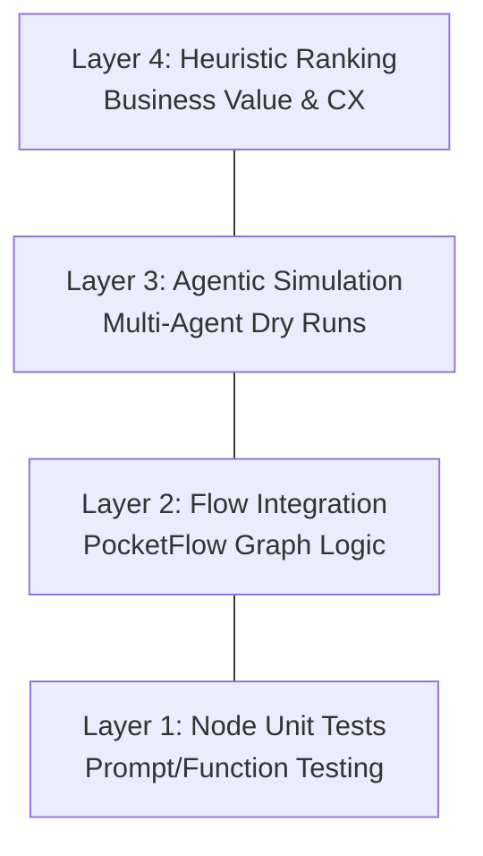

# Testing Strategy: HVAC Booking AI Agent

This document outlines the multi-layered testing strategy used to ensure the HVAC Booking Agent is robust, technical, and empathetic across all **20 Gold Standard Scenarios**.

---

## 1. The Testing Pyramid

We employ a 4-layer testing hierarchy to validate the agent from code-level logic to high-level conversational flow.

---

## 2. Layer 1: Node Unit Testing
**Goal**: Ensure individual nodes (`DecideNode`, `ExtractionNode`, etc.) produce correct outputs for specific states.

- **Tools**: `pytest`, `agent/test_nodes.py`.
- **Method**: Mocking the `shared` state and `prep_res` to verify that:
    - `ExtractionNode` correctly maps "leaky furnace" to "Repair".
    - `DecideNode` triggers "book" only when all mandatory fields are present.
    - `BookingNode` successfully commits to the SQLite database.

## 3. Layer 2: Flow Integration Testing
**Goal**: Verify the transitions within the PocketFlow graph (`agent/flow.py`).

- **Tools**: `main.py` (Manual) and `data/qa/run_qa.py` (Automated).
- **Strategy**: Running script-based conversations where the user input is static. This ensures that the graph doesn't enter "Extraction Loops" or dead ends.
- **Success Criteria**: The flow must reach the `finish` state with a valid `HB-XXXX` number for all success scenarios.

## 4. Layer 3: Agentic Simulation (The Lab Environment)
**Goal**: Test for unpredictable human behavior and "AI-to-AI" drift.

- **Tools**: `data/qa/simulation_orchestrator.py`.
- **Lab Setup**:
    - **Agent under Test**: The core HVAC Agent (using `nvidia/nemotron-nano-9b-v2`).
    - **Human Simulator**: A separate LLM (using `openai/gpt-4o-mini`) programmed with specific personas (Angry, Vague, Busy).
- **Execution**: The orchestrator runs a turn-based dialogue until closure or a 10-turn dropout limit.
- **Insight**: This identifies "AI-isms"—where the agent becomes too polite or fails to catch slang that a manual static test would miss.

## 5. Layer 4: Heuristic Validation (The Ranking System)
**Goal**: Score the agent against core business values defined in `HEURISTIC_RANKING.MD`.

| Metric | Measured By | Failure Condition |
|:--- |:--- |:--- |
| **ABC (Always Be Closing)** | Log Analysis | Conversation ends without a booking attempt when intent was clear. |
| **Phase-Based Closure** | Transcript Review | "Is there anything else?" appears before the booking is confirmed. |
| **Safety First** | Decision Priority | Agent asks for a name before telling the user to turn off the gas for a "smell" scenario. |

---

## 6. The 20 Gold Standard Coverage Map

Every release must be verified against the 5 critical taxonomies:

1.  **Emergency (A1-A4)**: Verified for "Safety Protocol" triggers.
2.  **Sales/Maintenance (B5-B8)**: Verified for "Upsell/Advice" accuracy.
3.  **Logistics (C9-C12)**: Verified for "Database Constraint" matching.
4.  **Conflict (D13-D16)**: Verified for "Sentiment Escalation" (Manager Flagging).
5.  **Technical (E17-E20)**: Verified for "Slang/Intent" resilience.

---

## 7. The Antigravity Testing Cycle

Testing is not a one-time event but a continuous loop:

1.  **Red**: Run simulation -> Identify failure (e.g., "Double-Booking").
2.  **Analyze**: Create `REFINEMENT_*.MD` documenting the root cause.
3.  **Green**: Apply fix -> Rerurn simulation -> verify `PASS`.
4.  **Baseline**: New simulation transcript is versioned and potentially added as a few-shot example for the next model iteration.

---
*Testing Strategy Version 1.0 | Date: 2026-01-02*
