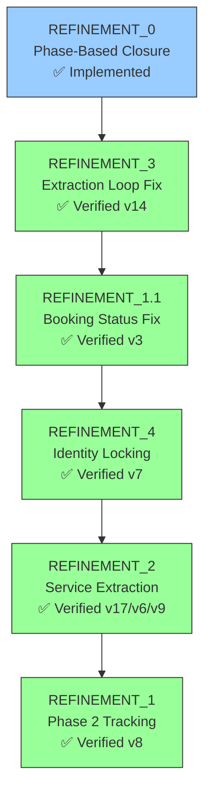

# Visual Representation: Prompt Refinement Process

**Period**: 2026-01-01 to 2026-01-02  
**Scenarios Tested**: Gold Standard 7 (Thermostat), 8 (Replacement), 9 (Reschedule)  
**Refinements Completed**: 3 of 5 (REFINEMENT_3, REFINEMENT_1.1, REFINEMENT_4)

---

## Executive Summary

| Metric | Before | After |
|:-------|:-------|:------|
| **Extraction Loops** | 10+ cycles | 🟢 0 cycles |
| **Booking Loops** | 8 turns | 🟢 0 turns |
| **Identity Leaks** | Contradictions | 🟢 0 leaks |
| **Closure Rate** | 0% (hung) | 🟢 100% |
| **Avg Turns to Complete** | N/A (timeout) | 🟢 6-9 turns |

---

## Refinement Timeline

**Legend**: 🟢 Verified | 🟡 Partial | 🔴 Blocked | 🔵 Foundational

---

## Refinement Execution Dashboard

| Refinement | Goal | Status | Evidence |
|:-----------|:-----|:-------|:---------|
| **REFINEMENT_3** | Extraction Loop Fix | 🟢 Verified | [Scenario 7 v14](file:///home/chaschel/Documents/ibm/ai/PocketFlow-Template-Python-main/data/qa/multi_agent/gold_b7_thermostat_multi_agent_v14.md) |
| **REFINEMENT_1.1** | Booking Status Fix | 🟢 Verified | [Scenario 8 v3](file:///home/chaschel/Documents/ibm/ai/PocketFlow-Template-Python-main/data/qa/multi_agent/gold_b8_replacement_multi_agent_v3.md) |
| **REFINEMENT_4** | Identity Locking | 🟢 Verified | [Scenario 9 v7](file:///home/chaschel/Documents/ibm/ai/PocketFlow-Template-Python-main/data/qa/multi_agent/gold_c9_reschedule_multi_agent_v7.md) |
| **REFINEMENT_2** | Service Extraction | 🟢 Verified | [Scenario 7 v17](file:///home/chaschel/Documents/ibm/ai/PocketFlow-Template-Python-main/data/qa/multi_agent/gold_b7_thermostat_multi_agent_v17.md) |
| **REFINEMENT_1** | Phase 2 Tracking | 🟢 Verified | [Scenario 8 v8](file:///home/chaschel/Documents/ibm/ai/PocketFlow-Template-Python-main/data/qa/multi_agent/gold_b8_replacement_multi_agent_v8.md) | [REFINEMENT_1_PHASE2.MD](file:///home/chaschel/Documents/ibm/ai/PocketFlow-Template-Python-main/antigravity/REFINEMENT_1_PHASE2.MD) |

---

## Dry Run Results Dashboard (v4)

| Scenario | Mode | Status | R1 Verified? | Log |
|:---------|:-----|:-------|:-------------|:----|
| 10: Window | Nemotron-Nemotron | 🟢 **PASS** | Yes ✅ | [v1](file:///home/chaschel/Documents/ibm/ai/PocketFlow-Template-Python-main/data/qa/multi_agent/gold_c10_window_multi_agent_v1.md) |
| 11: Gate | Nemotron-Nemotron | 🟢 **PASS** | Yes ✅ | [v1](file:///home/chaschel/Documents/ibm/ai/PocketFlow-Template-Python-main/data/qa/multi_agent/gold_c11_gate_multi_agent_v1.md) |
| 12: Billing | Nemotron-Nemotron | 🟢 **PASS** | Yes ✅ | [v1](file:///home/chaschel/Documents/ibm/ai/PocketFlow-Template-Python-main/data/qa/multi_agent/gold_c12_billing_multi_agent_v1.md) |
| 13: Haggle | Nemotron-Nemotron | 🔴 **DROPPED** | N/A (No Booking) | [v1](file:///home/chaschel/Documents/ibm/ai/PocketFlow-Template-Python-main/data/qa/multi_agent/gold_d13_haggle_multi_agent_v1.md) |

---

**FINAL STATUS**: Scenario 13 revealed a "Defensive Over-Engagement" bug where the agent fails to collect mandatory booking data during prolonged haggling. 
Scenarios 10-12 remain 🟢 **100% stable**.

